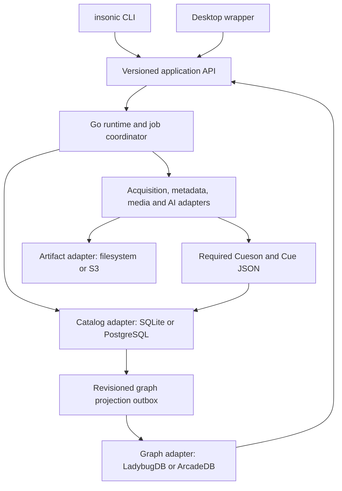
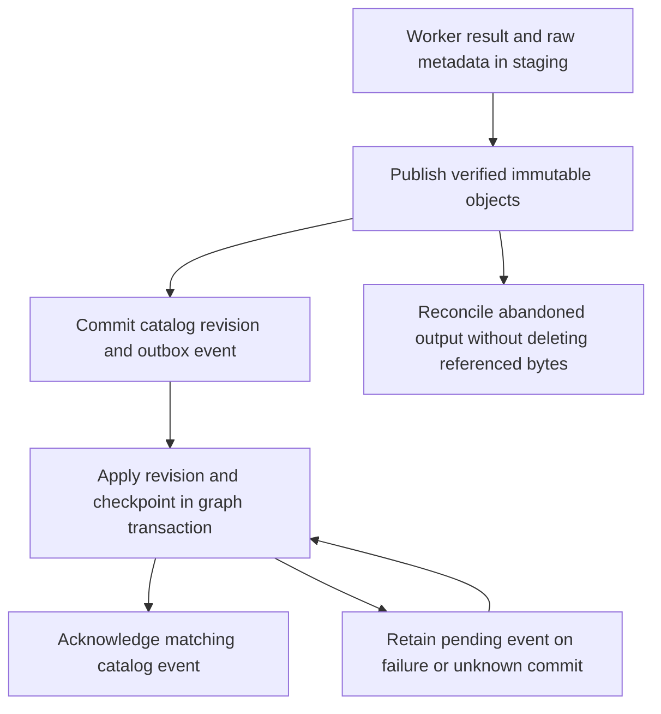

# System architecture

## One application contract, CLI first

The Go runtime owns workspace writes, job scheduling, secrets access and adapter connections. The CLI is the foundational interface. The desktop wrapper sends the same versioned application requests through its Go bridge to that runtime. Product behavior belongs in shared application packages rather than in UI handlers or command parsing. The [desktop contract](desktop.md) records feature parity and any temporary advanced or experimental CLI-only features.

The local default has one runtime per workspace. It holds the LadybugDB read/write database object, with separate connections for concurrent CLI and GUI requests. This follows LadybugDB's [concurrency contract](https://docs.ladybugdb.com/concurrency/), which does not allow independent database objects to open a live writable database. PostgreSQL and ArcadeDB connections use their remote services; choosing either does not change application operations or introduce a public application listener automatically.

The runtime starts on demand as a hidden process and exits after idle time when no job or client needs it. Long jobs can continue after the GUI closes; the user can choose Cancel instead. No permanent system service or administrative account is required for ordinary local use. A user-only Unix domain socket or Windows named pipe is the preferred IPC boundary. A loopback fallback, if needed, requires a per-session credential and origin checks. Installation never exposes a network service by default.

## Supported backend roles

Storage, operational catalog and graph are independently configurable adapter roles. Filesystem, SQLite and LadybugDB are the defaults. Generic S3-compliant storage, PostgreSQL and ArcadeDB are fully supported alternatives, with the same applicable media, pipeline, speaker, model, query, migration and recovery behavior. They are not emergency fallbacks. A workspace records the selected profiles and contract versions. Changing a profile is an explicit migration, not an automatic response to a connection failure.

The catalog owns mutable media entries, metadata observations and date selections, job attempts, pipeline revisions, credential references, speaker corrections, dataset/model associations, saved queries and publication checkpoints. Artifact storage owns immutable original media, metadata reports, derived audio, subtitle documents, training manifests, checkpoints and model bytes. Cueson governs subtitle interchange. The graph is a rebuildable projection of committed evidence and catalog revisions. ArcadeDB's multi-model capabilities do not move catalog authority out of the selected SQLite or PostgreSQL adapter.

The [logical schema](schema.md) defines IDs, revisions and relationships independently of SQL dialect and storage paths. [Storage](storage.md) specifies artifact and catalog adapters; [graph querying](graph.md) specifies graph adapter semantics and dialect boundaries. Official adapters must pass shared behavior tests plus backend-specific failure and migration cases. Optional community graph adapters may implement the versioned contract; no unsupported engine is bundled or advertised as equivalent.

## Publication across independent systems

Artifact storage, catalog and graph do not share a transaction. Publish and verify immutable objects first. Commit their references, the accepted catalog revision and a graph outbox event in one catalog transaction. Each projection target assigns its own consecutive event sequence in that transaction. One ordered publisher applies the next sequence only when the graph checkpoint matches its predecessor, committing facts, event receipt and checkpoint together. A higher catalog revision cannot skip an earlier required event. Acknowledge the matching event afterward; a lost graph response is resolved through exact event/operation receipts and its checkpoint.

Filesystem publication uses durable staging and an atomic final rename on the same filesystem. S3 publication uses unique immutable keys or a verified conditional-create capability, completed uploads and object read/checksum verification before catalog admission. A crash may leave an unreferenced object; it must not create a committed reference to a temporary or incomplete upload. Provider ETags and object version IDs are transport identifiers, not insonic content digests. Recovery distinguishes scratch, active uploads, unreferenced durable objects and referenced evidence.

Every catalog mutation carries an expected entity revision or an idempotent operation ID. Job and projection leases have a generation token; stale workers cannot commit or acknowledge newer work. PostgreSQL uses short transactions and workspace-scoped ownership, with server-time lease expiry. A replacement projection owner must atomically install its higher generation in the graph checkpoint before publishing. Catalog lease acquisition alone does not fence a separate graph service. Every graph write checks that installed generation and predecessor sequence in the same transaction as its facts. Takeover preserves the committed sequence and reconciles any already committed but unacknowledged events before continuing. LadybugDB additionally requires exclusive local runtime/database ownership; an expired catalog lease does not authorize opening a still-live embedded writer. Embedded graph files are never opened directly from an object store or copied between live clients.

Graph responses disclose their published catalog revision and pending work. Ordinary catalog search and speaker-model lookup remain available when graph publication is delayed. Rebuilding the graph uses accepted evidence and current selections without retranscribing, retraining or calling paid providers. Backups bind a catalog snapshot and artifact manifest to a recorded revision; the graph can be rebuilt from that authority set.

## Package and adapter boundaries

Package boundaries separate `cmd/insonic` from shared `internal/app`, `internal/runtime`, `internal/catalog`, `internal/storage`, `internal/pipeline`, `internal/adapters`, `internal/subtitles`, `internal/speakers`, `internal/graph` and `internal/secrets`. The desktop executable and TypeScript UI use those shared application contracts. Add packages when they have a concrete responsibility.

Adapters expose a versioned identity, configuration schema, capabilities, health and typed errors. Catalog operations accept domain records and transactions, not raw SQL supplied by processing adapters. Artifact operations accept immutable object references, not arbitrary local paths. Graph operations accept normalized projection changes or a declared native query dialect. AI adapters receive verified materializations and return immutable artifacts plus structured provenance. User interface code uses these application contracts without backend-specific branches.

Executable adapters use a versioned request/result/event protocol. Each job records adapter identity, executable or remote endpoint identity, model version, contract version and exact effective options. Third-party executable adapters run without a shell, with literal argument arrays, bounded I/O, hidden Windows console creation and explicit cancellation. Their ability to execute code is disclosed during configuration; sandboxing is not assumed.

## Failure boundaries

The runtime distinguishes unavailable sources or object stores, catalog/graph connection failures, decoding failure, insufficient capacity, missing model, authentication failure, quota failure, invalid model output, cancelled work and pending publication. Unknown remote commit outcomes require reconciliation before retry. It reports the next useful action in plain language. A failure stops operations that need that backend while unrelated usable work remains available. It does not silently switch storage, database or AI provider. Credential values and full transcripts are absent from default diagnostics.
