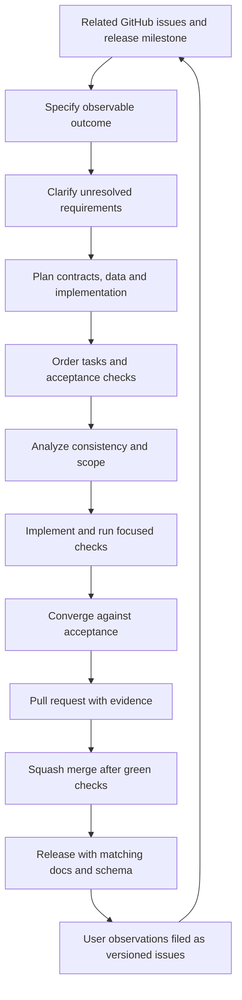

# Development workflow

## Tracking and scope

GitHub Issues are the primary work intake, milestones define release outcomes and a GitHub Project provides status. Issues state concrete acceptance, affected versions for defects, dependencies and scope exclusions. The board tracks issues and pull requests without duplicating task text. Use statuses Backlog, Ready, In progress, In review and Done, with Slice, Release, Priority and Area fields.

[Delivery outcomes](roadmap.md) describe product dependencies. Numbered implementation plans and verification records live under `specs/`; public documentation describes system contracts and does not render those planning artifacts.

## Spec Kit slices

Spec Kit organizes bounded, observable work. Python 3.11 or newer supports its cross-platform maintainer helpers. The application runtime uses the language and dependency boundaries defined in [technology decisions](technology.md).

A slice has `spec.md`, `plan.md` and `tasks.md`, with research, data-model, contracts and checklists where useful. Small work stays small; empty artifacts are unnecessary. Resolve critical consistency findings before implementation. Keep each branch and pull request focused on a coherent outcome. Dates and internal progress entries are chronological.

Resolve routine implementation choices against approved product requirements. Clarify unresolved decisions that materially change behavior.

## Building the workspace runtime

1. Use Go 1.27.1, as pinned in `go.mod`, and Node 22 or newer for documentation.
2. Run `go test ./...` and `go vet ./...`.
3. Build the CLI with `go build -o build/insonic ./cmd/insonic` (use `build/insonic.exe` on Windows).
4. Run the built executable with `workspace init <directory> --json`.
5. Select it with `--workspace <directory> workspace show --json` or discover it by running inside that workspace.

Workspace initialization validates the packaged JSON contract and cannot replace an existing workspace. Clients share a current-user local runtime; it starts on demand and exits after idle time. `jobs start <milliseconds>`, `jobs show <job-id>`, `jobs history <job-id>`, `jobs cancel <job-id>` and `jobs retry <job-id>` exercise a bounded durable qualification operation. Jobs and attempts survive owner restarts. Interrupted or expired attempts resume through fresh fenced claims; cancelled jobs remain cancelled until explicit retry. `doctor --json` reports the available catalog and configured storage/graph profiles without returning credential values or switching backends.

The desktop foundation uses the same workspace operation through its native bridge and packages the local documentation. Dedicated library, pipeline, speaker, playback and query GUI controls remain the desktop delivery contract; the shared bridge carries the corresponding runtime operations. Native qualification pins exact dependencies, verifies downloaded artifact checksums and executes bounded platform/backend fixtures. Artifact availability on an architecture does not establish executed package support.

Managed artifact commands share this runtime: publish/show/verify/materialize/reconcile/abort/retire, retention reference admission/release, materialization lease renewal/release and expired cache pruning. Their exact usage, default bounds and recovery behavior are defined in [storage](storage.md). They operate on real bytes through filesystem/S3 adapters, including library import/metadata, downloaded models and current recording derivatives. Dedicated desktop storage controls remain pending, while the shared bridge accepts the versioned runtime operations.

Owner locks use the private per-user runtime directory and canonical workspace root, so read-only metadata and control-directory edits preserve one owner. A runtime admits up to 1,024 active qualification workers. Terminal history remains in the selected catalog and cannot consume active-worker capacity. Runtime shutdown records interruption rather than user cancellation. Five-second attempt leases renew every second; recovery claims only expired or explicitly interrupted authority, preserving prior attempts.

## Automated checks and user observations

Before merging, run checks relevant to changed behavior, dependency/artifact integrity and reproducible builds. Secret redaction, archive extraction, job attempt ownership and graph publication require meaningful tests. Reversible text changes need formatting and link checks.

Users ordinarily verify released behavior and report observations through issues. A report includes version, platform, expected/actual behavior and a minimal reproduction. Correlate symptoms before asserting a cause. A green unrelated unit suite does not resolve a reported field observation.

## CI budget

Repository CI has parallel integrity, documentation, native-platform and alternative-backend jobs. Native checks run on Linux, Windows and macOS, including real dependency operations and the desktop bridge. Backend fixtures exercise PostgreSQL, S3-compatible storage and ArcadeDB. Foundation and documentation checks always run. A change classifier keeps stable platform check names while skipping expensive native work for prose-only changes. Runtime/catalog/schema changes run core and native acceptance plus PostgreSQL catalog fixtures; unknown paths and unavailable diffs receive full qualification. Declared Go, Wails and Ladybug binding pins must match qualification metadata. Each job has a ten-minute timeout. Cache dependencies, cancel obsolete branch runs and consume committed assets and lockfiles. Network brand freshness checks are manually triggered.

Measure end-to-end turnaround. When it approaches ten minutes, remove redundant work, tighten change scopes or parallelize independent checks. Native package checks use a relevant platform matrix, with expensive packaging in release jobs. No CI suite, native/backend qualification or required check invokes transcription/diarization, initializes or loads their models, downloads model weights or requires engine results, including cached or small models. Deterministic stage results exercise orchestration and document/storage contracts; bounded real-media probing/extraction and exact Cueson operations are allowed.

## Explicit maintainer engine qualification

Committed CC BY 3.0 speech audio and a short dialogue video are ordinary Git files under `tests/fixtures/media/`, with license/attribution, source/rendition/crop provenance, hashes, measured streams and separately declared reference expectations. Clean checkout and CI use these bytes without Git LFS or test-time media downloads. Supplied subtitles and constructed speaker turns qualify document/timing behavior, not model quality.

Actual recognition and diarization testing runs only through the explicit opt-in maintainer path. It is outside CI and merge requirements. Select installed local Python environments and registered exact managed models, record settings/device/thread/time/output bounds, and retain measured resource and quality diagnostics. No worker silently downloads weights or routes to another provider/device. A reference-text oracle cannot be supplied as alleged generated recognition output.

`insonic processing tools CONFIGURATION.json` validates the registered `processing-tools` contract before publishing workspace configuration. Selected executables and the worker require absolute paths and lowercase SHA-256 identities; decoder configuration also requires its exact version. Positive duration, input/output, wall-time and thread limits are checked independently of inference. Omitted inference tools remain valid for supplied-subtitle assembly and export, and selected tools are qualified only when their operation runs. CPU is the default; selected CUDA failure never silently switches devices.

Report recognition/timing agreement, speaker-count/coverage/overlap diagnostics and their reference basis separately from schema/document validity. Published subtitle display windows and editorial character labels are not sample-accurate voice activity or biometric identity truth. Distinguish measured engine behavior, deterministic regressions and unverified platforms in the qualification receipt.

## Documentation and contract governance

Public documentation states the authoritative system behavior. Keep slice identifiers, task records and verification evidence in internal planning. Historical and version-change descriptions belong in the [changelog](changelog.md). The documentation index carries the concise implementation-status statement.

Use numbered steps for a procedure with one linear path. Use a diagram when branches, relationships, dependencies, feedback or retry paths explain the system more clearly. Keep Mermaid flowcharts top-down with `TB` or `TD` orientation.

The software, documentation and master JSON Schema share one release version. The [JSON contracts](contracts.md) define machine-readable boundaries; the [logical catalog schema](schema.md) defines relationships and integrity. Prefer backward and forward compatibility where practical. Explain breaking changes in the changelog and concise release highlights, including the migration or affected interface.

For every major release, rescan all documentation for technical terms and refresh the [glossary](glossary.md). Each entry explains the exact term, links a primary external learning reference and points to the local pages that use it most heavily.

## GitHub setup and merging

The maintainer bootstrap configures Issues, squash-only merges, automatic merged-branch deletion, labels, milestones and a Project. Branch protection requires the `foundation` and `docs` checks and resolved conversations. Activate protection after those checks exist.

`npm run github:check` reads setup status. `npm run github:apply` applies prepared settings to an existing repository with repository-administration and organization-Project permissions. It does not create or push a repository. Repeated setup reuses tracked issues, milestones and the Project, preserving edits, existing values and archived work. Initial status setup applies only to a new empty Project. Missing required status options or established-item metadata are reported for completion. After a partial failure, resolve permissions, rerun and confirm settings and membership through API readback.

Squash merges follow green required checks and resolved review findings. Human PR approval, code-owner approval and last-push approval are not mandatory. The bootstrap preserves zero required approvals; automated analysis and focused checks remain part of development. Agents follow the owner's authorization for the merge itself.

See [contribution guidance](../../CONTRIBUTING.md) and [release workflow](releases.md).
