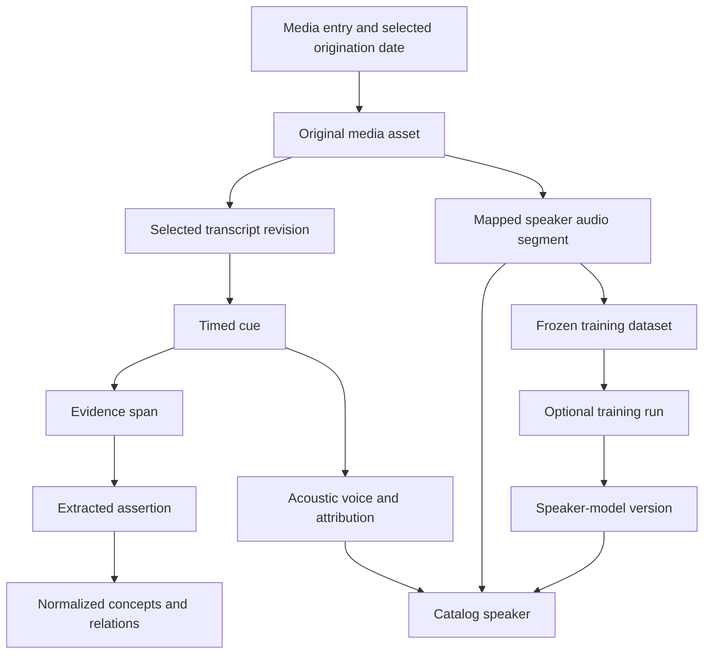

# Queries, timeline and graph

## Evidence graph and supported adapters

LadybugDB is the default semantic graph; ArcadeDB is a fully supported alternative. The selected SQLite or PostgreSQL catalog remains the operational authority described in [architecture](architecture.md). Both graph adapters project media, assets, metadata/date selections, transcript revisions, cues, acoustic voices, speaker identities, terms, assertions, concepts, evidence spans, speaker audio segments and trained-model lineage. Every assertion cites actual cue IDs, original source intervals, transcript revision and processing-run identity. Model relationships cite frozen dataset memberships and immutable versions rather than implying that a model is the speaker.



Backend-specific node/relationship DDL and migrations implement the [logical schema](schema.md). Use stable catalog IDs as graph identities. LadybugDB node tables are schema-first; ArcadeDB uses its own types, constraints and indexes. Native record IDs are not public entity IDs. Parameterize values on both backends.

## Graph adapter and publication

The graph contract includes `Capabilities`, `EnsureSchema`, `FenceGeneration`, `ApplyRevision`, `ReadCheckpoint`, `Query`, `Explain`, `ExportSnapshot` and `Rebuild`. `ApplyRevision` accepts workspace/target, event sequence, predecessor sequence, operation ID, payload digest, catalog revision and installed projection generation. One publisher per target applies a gap-free sequence; fact changes, event receipt and checkpoint commit atomically only when generation and predecessor match. A later catalog revision cannot bypass an earlier event, even when they affect different entities. Repeated exact events are harmless; mismatched receipts or generations fail. A replacement owner first uses `FenceGeneration` to atomically install its higher catalog lease generation while retaining the graph's committed sequence. Old writers then fail their transactional generation check. Reconcile committed-but-unacknowledged receipts before continuing. Catalog acknowledgement is separately guarded by its current lease. An unknown remote outcome is reconciled by exact event/operation receipt before replay.

The capabilities response names server/core and adapter versions, schema version, supported native language identifiers, parameter types, transaction behavior, cancellation/timeouts, pagination and optional search/algorithm features. The runtime tests its required contract against a pinned supported range. A health check alone does not establish support. When graph publication is unavailable, accepted catalog evidence and model lookups remain usable; graph results disclose the published revision and pending changes.

LadybugDB runs inside the owning workspace runtime, with one read/write database object and separate connections. ArcadeDB is selected through a configured service endpoint/database using its [HTTP/JSON query and transaction API](https://docs.arcadedb.com/arcadedb/reference/http-api/http). Qualify session, expiry, authentication and commit semantics for the supported server version. The adapter never assumes a failed HTTP response proves a transaction did not commit.

## Chunking and assertions

Chunk adapters build bounded windows from complete selected cues, preserving overlap and speaker transitions where possible. Each chunk records its exact cue list, source span, transcript digest, attribution revision and policy/model version. Overlapping windows deduplicate evidence by source identity rather than producing false independent support.

An extraction adapter returns structured propositions with cited cues, subject/relation/object, polarity, modality and relevant conditions. Validation checks shape, cue existence, source ownership and time bounds before publication. An assertion states what a speaker said; it does not establish the proposition's truth. Quotations and reported positions retain who delivered the words and whose position was described.

Materially different conditions or negation cannot collapse into one normalized proposition. Unsupported assertions are rejected or retained as unpublished diagnostics. Valid output publishes automatically without a mandatory approval queue. Failed extraction leaves transcript search available.

## Portable operations and native query dialects

Application operations provide media listing, speaker/model lookup, term/text search, time-range filtering, evidence traversal and graph-view results on either supported backend. A versioned normalized `QuerySpec` represents these operations with typed filters, parameters, traversal limits and deterministic ordering. Each adapter compiles it to its own language and normalizes results to catalog IDs and typed values. Shared fixtures compare evidence, null values, timestamp handling, pagination and graph relationships. Full support means application behavior parity; it does not mean every engine-specific function exists in the other engine.

Native queries remain available for advanced work. LadybugDB uses its openCypher dialect. ArcadeDB provides [SQL and native OpenCypher](https://docs.arcadedb.com/arcadedb/reference/cypher/chapter), with current documentation distinguishing recommended `opencypher` from legacy `cypher`. SQL graph functions, language identifiers, traversal semantics and transaction features must be validated against the actual supported server, not inferred from a Cypher label. Native queries are tagged with a dialect, for example `ladybug-cypher`, `arcade-opencypher` or `arcade-sql`. Unsupported languages/features produce actionable errors.

Command contracts:

```sh
insonic media list --json
insonic search "sample phrase" --speaker SPEAKER_ID --json
insonic models list --speaker SPEAKER_ID --json
insonic query run --saved QUERY_ID
insonic query native --dialect ladybug-cypher --file query.cypher --json
insonic query native --dialect arcade-sql --file query.sql --json
```

Return media/source IDs, speaker or voice state, quoted cue text, source start/end time, selected revisions, graph publication status and pagination information. The GUI wraps the same query/result contract and opens cited media at the correct original time. Result snapshots retain the catalog/projection revision and original query version, so later corrections do not erase what the result represented.

## Timeline

The calendar timeline includes all library entries, not just the current page of results. The selected recording-date observation and its precision/bounds drive placement. Publication or import dates are explicitly chosen alternatives, never invisible substitutes. Undated entries have a visible group; approximate dates appear as ranges. Zoom, pan, keyboard navigation, filtering and virtualized loading support large libraries.

Selecting an entry opens its within-media timeline of cues, voices, speaker audio segments and assertion spans. These media-relative intervals differ from calendar placement. Audio and video share the same correlation model. A timezone or origination-date correction changes calendar placement without rewriting cue or segment intervals.

## Saved graph views and AI assistance

A saved query version records either a normalized `QuerySpec` or native text/dialect, typed parameters, title, catalog and projection schema versions, adapter/backend identity, capability fingerprint and validation result. Graph-view settings, force-directed layout positions and optional pinned result snapshots are separate records. Keep old versions when a user edits a query. A native query can be validated for additional backend/version targets explicitly; switching backends does not pretend arbitrary Cypher/SQL text is portable. Retain incompatible saved queries with an explanation and allow a compatible revision to be saved.

Force-directed rendering displays selected nodes/relationships with labels, provenance inspection, filtering and a tabular accessible alternative. Persist layout positions separately from graph facts. A truncated view states omitted node/edge counts and permits deliberate expansion. Saveable results and speaker/model relationships use the same normalized result envelope on both engines.

AI query assistance is optional until configured. The chosen adapter receives the selected backend's schema and capability context and can propose a normalized operation or native query with a declared dialect. Read-only execution can proceed under the configured assistance mode after structural validation, with optional preview for users who want it. Do not add a compulsory review step to every suggestion. The interface shows the generated query, explanation and provider/model provenance with its result. Result excerpts are sent only when the configured task requests them. Direct queries remain available if assistance is disabled or fails.

Ordinary exploration uses bounded read operations; maintenance and advanced mutations are separate explicit operations. Native-language enforcement belongs in each adapter's query/privilege contract, including engines that lack an equivalent read-only transaction mode. Treat user queries as data, parameterize values and enforce the selected operation mode. This is an integrity boundary rather than a subject-matter policy.

## Supported and community graph engines

Both graph adapters must pass projection replay, corrections, dataset/model lineage, query results, saved views, migration/rebuild and failure recovery. Backend-specific optional algorithms remain discoverable capabilities. Other graph engines may be user-provided community adapters through the same extension contract. They are labelled unofficial, with declared dependencies and licenses. They are not bundled, recommended or silently selected. [ArcadeDB's Apache 2.0 license](https://github.com/ArcadeData/arcadedb/blob/main/LICENSE) fits the project's official dependency direction; every exact redistributed artifact still needs its own notices reviewed during packaging.
