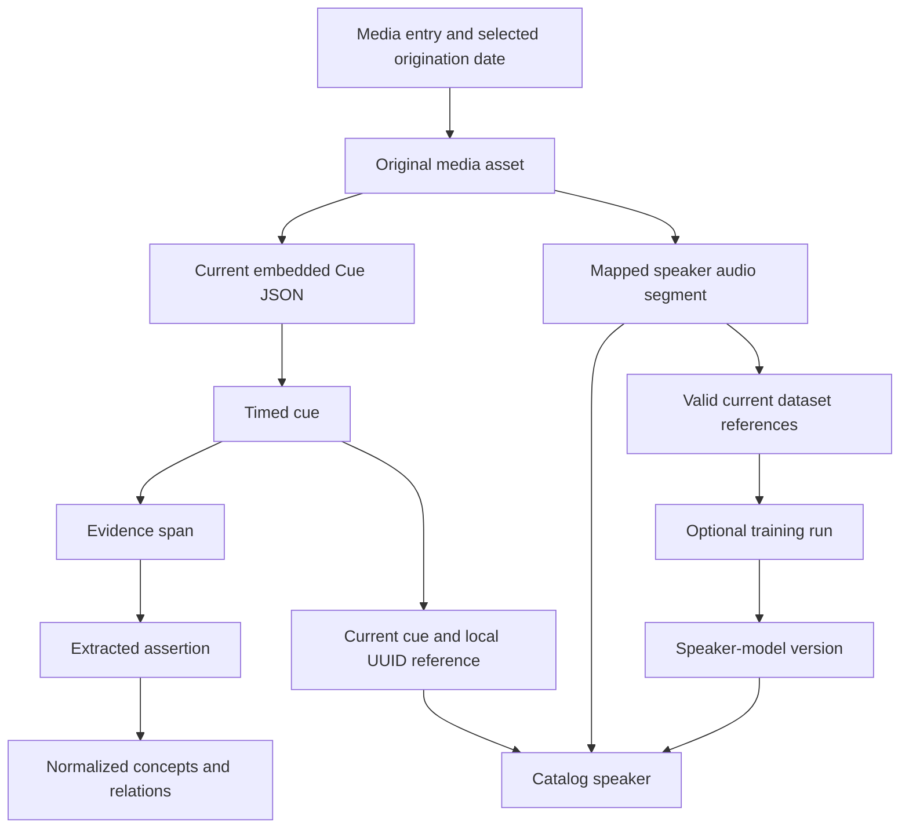

# Queries, timeline and graph

## Evidence graph and supported adapters

LadybugDB is the default semantic graph; ArcadeDB is a fully supported alternative. The selected SQLite or PostgreSQL catalog remains the operational authority described in [architecture](architecture.md). Both graph adapters project media, assets, metadata/date selections, current recording/document/cue references, local voice UUIDs, speaker identities, terms, assertions, concepts, evidence spans, speaker audio segments and trained-model lineage. Every assertion cites actual cue IDs, original source intervals, current document digest and processing-run identity. Model relationships cite reference-only dataset/run provenance and durable output versions rather than implying that a model is the speaker.



Backend-specific node/relationship DDL and migrations implement the [logical schema](schema.md). Use stable catalog IDs as graph identities. LadybugDB node tables are schema-first; ArcadeDB uses its own types, constraints and indexes. Native record IDs are not public entity IDs. Parameterize values on both backends.

## Graph adapter and publication

The graph contract includes `Capabilities`, `EnsureSchema`, `FenceGeneration`, `ApplyRevision`, `ReadCheckpoint`, `Query`, `Explain`, `ExportSnapshot` and `Rebuild`. `ApplyRevision` accepts workspace/target, event sequence, predecessor sequence, operation ID, payload digest, catalog revision and installed projection generation. One publisher per target applies a gap-free sequence; fact changes, event receipt and checkpoint commit atomically only when generation and predecessor match. A later catalog revision cannot bypass an earlier event, even when they affect different entities. Repeated exact events are harmless; mismatched receipts or generations fail. A replacement owner first uses `FenceGeneration` to atomically install its higher catalog lease generation while retaining the graph's committed sequence. Old writers then fail their transactional generation check. Reconcile committed-but-unacknowledged receipts before continuing. Catalog acknowledgement is separately guarded by its current lease. An unknown remote outcome is reconciled by exact event/operation receipt before replay.

The capabilities response names server/core and adapter versions, schema version, supported native language identifiers, parameter types, transaction behavior, cancellation/timeouts, pagination and optional search/algorithm features. Required checks qualify LadybugDB 0.21.2 and ArcadeDB 26.9.1. A configured expected backend version must match the observed engine version; an unavailable server version remains unknown. A health check alone does not establish support. When graph publication is unavailable, accepted catalog evidence and model lookups remain usable; graph results disclose the published revision and pending changes.

LadybugDB runs inside the owning workspace runtime, with one read/write database object and separate connections. ArcadeDB is selected through a configured service endpoint/database using its [HTTP/JSON query and transaction API](https://docs.arcadedb.com/arcadedb/reference/http-api/http). Qualify session, expiry, authentication and commit semantics for the supported server version. The adapter never assumes a failed HTTP response proves a transaction did not commit.

## Chunking and assertions

Chunk adapters build bounded windows from complete selected cues, preserving overlap and speaker transitions where possible. Each chunk records current recording/document/cue references and policy/model provenance; it does not copy assignment arrays. Resolve source intervals through the current document/map. Overlapping windows deduplicate evidence by source identity rather than producing false independent support.

An extraction adapter returns structured propositions with cited cues, subject/relation/object, polarity, modality and relevant conditions. Validation checks shape, cue existence, source ownership and time bounds before publication. An assertion states what a speaker said; it does not establish the proposition's truth. Quotations and reported positions retain who delivered the words and whose position was described.

Materially different conditions or negation cannot collapse into one normalized proposition. Unsupported assertions are rejected or retained as unpublished diagnostics. Valid output publishes automatically without a mandatory approval queue. Failed extraction leaves transcript search available.

## Portable operations and native query dialects

Application operations provide media listing, speaker/model lookup, term/text search, time-range filtering, evidence traversal and graph-view results on either supported backend. A versioned normalized `QuerySpec` represents these operations with typed filters, parameters, traversal limits and deterministic ordering. Both adapters read current reference nodes and relationships; the shared evaluator hydrates authoritative catalog values and applies filters, ordering and bounded pagination. Native text uses the declared engine language. Shared fixtures compare evidence, null values, timestamp handling, pagination and graph relationships. Full support means application behavior parity; it does not mean every engine-specific function exists in the other engine.

Native queries remain available for advanced work. LadybugDB uses its openCypher dialect. ArcadeDB provides [SQL and native OpenCypher](https://docs.arcadedb.com/arcadedb/reference/cypher/chapter), with current documentation distinguishing recommended `opencypher` from legacy `cypher`. SQL graph functions, language identifiers, traversal semantics and transaction features must be validated against the actual supported server, not inferred from a Cypher label. Native queries are tagged with a dialect, for example `ladybug-cypher`, `arcade-opencypher` or `arcade-sql`. Unsupported languages/features produce actionable errors.

Command contracts:

```sh
insonic media list --json
insonic search "sample phrase" --speaker SPEAKER_ID --json
insonic models list --speaker SPEAKER_ID --json
insonic query run --saved QUERY_ID
insonic query native --dialect ladybug-cypher --file query.cypher --json
insonic query native --dialect arcade-sql --file query.sql --json
```

Return media/source IDs, speaker or voice state, quoted cue text, source start/end time, selected revisions, graph publication status and pagination information. The GUI wraps the same query/result contract and opens cited media at the correct original time. Results report catalog revision, source IDs and current document digests. Graph status separately exposes the publication checkpoint and pending count. Portable reads may use accepted current catalog evidence if publication is unavailable; their basis and graph error disclose that condition. Replacement invalidates stale referenced results and preparation rather than preserving old assignments or frozen transcript copies. Current speaker timing is resolved from the embedded document.

## Timeline

The calendar timeline includes all library entries, not just the current page of results. The selected recording-date observation and its precision/bounds drive placement. Publication or import dates are explicitly chosen alternatives, never invisible substitutes. Undated entries have a visible group; approximate dates appear as ranges. Zoom, pan, keyboard navigation, filtering and bounded continuation support large libraries.

Selecting an entry opens its within-media timeline of cues, voices, speaker audio segments and assertion spans. These media-relative intervals differ from calendar placement. Audio and video share the same correlation model. A timezone or origination-date correction changes calendar placement without rewriting cue or segment intervals.

## Saved graph views and AI assistance

A saved query version records either a normalized `QuerySpec` or native text/dialect, typed parameters, title, catalog and projection schema versions, adapter/backend identity, capability fingerprint and validation result. Graph-view settings and force-directed layout positions are separate records. Saved definitions and layouts retain no result snapshots or processing documents. Keep old versions when a user edits a query. Saving checks the currently selected target when reachable and stores immutable compatibility metadata. Unreachable checks remain pending. The validate operation checks the current target; switching backends does not pretend arbitrary Cypher/SQL text is portable. Retain incompatible saved queries with an explanation and allow a compatible revision to be saved.

Force-directed rendering displays selected nodes/relationships with labels, provenance inspection, filtering and a tabular accessible alternative. Persist layout positions separately from graph facts. A truncated view states omitted node/edge counts and permits deliberate expansion. Saved definitions and speaker/model relationships use the same normalized result envelope on both engines.

AI query assistance is optional until configured. The chosen adapter receives the selected backend's schema and capability context and can propose a normalized operation or native query with a declared dialect. Read-only execution can proceed under the configured assistance mode after structural validation, with optional preview for users who want it. Do not add a compulsory review step to every suggestion. The interface shows the generated query, explanation and provider/model provenance with its result. Result excerpts are sent only when the configured task requests them. Direct queries remain available if assistance is disabled or fails.

Ordinary exploration uses bounded read operations; maintenance and advanced mutations are separate explicit operations. Native-language enforcement belongs in each adapter's query/privilege contract, including engines that lack an equivalent read-only transaction mode. Treat user queries as data, parameterize values and enforce the selected operation mode. This is an integrity boundary rather than a subject-matter policy.

## Supported and community graph engines

Both graph adapters must pass projection replay, corrections, dataset/model lineage, query results, saved views, migration/rebuild and failure recovery. Backend-specific optional algorithms remain discoverable capabilities. Other graph engines may be user-provided community adapters through the same extension contract. They are labelled unofficial, with declared dependencies and licenses. They are not bundled, recommended or silently selected. [ArcadeDB's Apache 2.0 license](https://github.com/ArcadeData/arcadedb/blob/main/LICENSE) fits the project's official dependency direction; every exact redistributed artifact still needs its own notices reviewed during packaging.

## Executable exploration operations

The source CLI and desktop Explore route implement current evidence extraction, the seven normalized operations, bounded native reads, calendars, recording timelines, saved query versions and separate layouts. Optional query assistance is implemented through an explicitly configured local or hosted HTTP adapter; training engines retain a separate delivery contract.

```sh
insonic graph capabilities --json
insonic graph status --json
insonic graph publish --json
insonic graph rebuild --json
insonic evidence extract MEDIA_ID --input extraction.json --json
insonic evidence show MEDIA_ID --json
insonic query run --input query.json --json
insonic query explain --input query.json --json
insonic query validate --input query.json --json
insonic query save QUERY_ID --input saved-update.json --json
insonic query show QUERY_ID --json
insonic timeline calendar --input calendar.json --json
insonic timeline recording MEDIA_ID --json
insonic views save VIEW_ID --input layout-update.json --json
insonic views show VIEW_ID --json
```

A portable input is `{"definition":{"mode":"normalized","operation":"text-search","filters":{"text":"example"},"order_by":[{"field":"source_start_us","direction":"asc"}],"pagination":{"limit":100}}}`. Operations are `media-list`, `speaker-search`, `model-list`, `text-search`, `time-range`, `evidence-traverse` and `graph-view`. Filters can select media/speaker/entity/concept IDs, text, model kind, selected origination bounds or a half-open source interval in integer microseconds. Traversal declares direction, relationship types and depth (1 through 32). Continuation cursors bind the query and current values; corrected evidence makes an old cursor conflict.

Internal publication uses an immutable reference snapshot with its own 128 MiB budget, separate from the 8 MiB per-work input budget. Reference reads use pages of up to 1,000 rows (smaller pages for large individual references) in one consistent read transaction; facts, receipt and checkpoint still commit atomically. Exceeding the snapshot budget reports a limit without accepting a partial projection.

Query pages return at most 500 rows and 512 KiB. Original source microseconds and exact date nanoseconds travel as decimal strings in hydrated results. Native text is limited to 64 KiB, one read statement and supported pure functions, with a 20-second backend timeout. DDL, mutations, transaction control, effectful procedures, PROFILE and reserved profiling parameters are rejected. A workspace owns one graph database; binding a database owned by another workspace fails. Untagged source builds report embedded Ladybug unavailable; prepared packages include the real adapter.

The default `cue-statement` extraction records literal cue/voice source statements, without inferring a semantic proposition. An explicitly elected `insonic-http` extractor can return structured propositions. Extraction input contains `expected_revision`, `document_digest` and `configuration`. The named default configuration uses contract `1`, 16 complete cues per window, two cues of overlap, a 64 KiB chunk bound, 30-second timeout and 512 KiB response bound. The HTTP protocol receives contract version, operation, elected model and chunk cues; its response contains contract version and an assertions array. Each assertion names subject, relation, object, polarity, modality, conditions and actual cue IDs, with optional local speaker and quoted attribution. Remote route and opaque credentials must be explicitly configured. Invalid output produces bounded diagnostics; it does not block text search.

Saved updates contain `expected_revision` and `query` (title, definition and typed parameters). Creation expects zero; edits append a new immutable version. Layout updates contain `expected_revision`, `query_id` and `layout` (positions, paused motion, label filter and drawing limit). Layout coordinates never modify evidence. A graph page states omitted nodes and relationships; the drawing limits itself to 200 nodes and offers table inspection and deliberate relationship expansion.

Calendar input contains `filter` (`from`, `through`, `timezone`, `include_undated`) and optional pagination. Day precision preserves its literal day; instants use the selected timezone and approximate ranges intersect the viewport. Recording timelines resolve current cues/assertions/segments on the original clock. Desktop selections and playback tickets are fenced against replacement; a changed recording clears inspected evidence on the next authority check.

Required tests use supplied current cues and deterministic extraction replies, real pinned graph transactions and native Explore/package journeys. They never initialize or run recognition/diarization models or download weights.


## Configured query assistance

`insonic query assistance-show --json` reads workspace configuration without contacting a provider. `insonic query assistance-set --input assistance-setting.json --json` saves `expected_revision` and `configuration` with compare-and-swap. Settings travel with catalog snapshots; credentials remain opaque IDs resolved by the selected credential backend. Assistance is disabled until elected. The `insonic-http` contract version `1` works with a local loopback or hosted endpoint that implements this protocol. A generic model API requires a compatible adapter service.

```json
{
  "expected_revision": 0,
  "configuration": {
    "enabled": true,
    "adapter": "insonic-http",
    "contract_version": "1",
    "route": "local",
    "endpoint": "http://127.0.0.1:9001/query",
    "model": "selected-model",
    "mode": "suggest"
  }
}
```

`insonic query assist --input assistance-request.json --json` accepts `{"prompt":"List current recordings","mode":"suggest"}`. Omit `mode` to use the saved preference, or elect `auto-run` to validate and execute a current read. An optional `configuration` overrides the saved choice for that request; `settings_revision` fences the observed configuration. No failure chooses another route or model. The response includes the exact `proposal`, `explanation`, validation status, route/model/settings/capability provenance and, for auto-run, current `execution`. The desktop Explore screen exposes the same configuration and separate Suggest query and Assist and run query actions. Load proposal into editor preserves the entire query, including fields outside the compact controls, for editing, direct execution or versioned saving. Pending UI results are discarded after prompt/settings/editor changes, navigation or an explicit discard action; discarding UI ownership does not promise to undo a read already sent to the runtime.

The provider receives one JSON POST containing `contract_version`, `operation: "query-assistance"`, `model`, `prompt`, self-contained bare query schema, selected capabilities, finite `limits` and optional `context`. It returns exactly `{"contract_version":"1","query":{"definition":{"mode":"normalized","operation":"media-list","pagination":{"limit":5}}},"explanation":"List current recordings"}`. Unknown fields, duplicate keys, trailing documents, malformed parameters and structural mutations fail. A normalized proposal must select an explicit bounded first page, without a cursor. Native text declares a compatible dialect and must pass the ordinary read guard and actual selected backend EXPLAIN before auto-run. Unreachable validation stays pending in a suggestion and cannot auto-run. The physical native schema uses `Entity(id, workspace, entity_id, kind, reference)` and `EvidenceLink(id, kind)`; normalized operations hydrate current catalog text and clocks.

Default provider timeout is 30 seconds (maximum 60); query timeout is at most 20 seconds, with a 90-second assistance IPC ceiling. Prompts are at most 16 KiB. Provider responses default to 256 KiB (maximum 512 KiB). Results default to 100 rows (maximum 500) and 512 KiB; native engines retain their existing 500-row/512-KiB ceiling and a lower elected result ceiling is checked before returning. All limits can be reduced. Result excerpts are absent by default. An explicit normalized `context_query` elects at most 25 current rows and 32 KiB, retaining exact source-clock strings. Neither configuration nor a saved query stores these results. HTTP redirects are refused, credentials require HTTPS except on loopback, and provider bodies never become diagnostic messages.

Required checks refuse production assistance under CI environment markers before HTTP or credential access. Deterministic fixture construction exercises the same proposal validation, ordinary backend execution and mounted native UI without model loading, inference or weight downloads. Maintainers may elect a compatible provider outside CI.

Typed integer parameters accept JSON integers or canonical signed decimal strings in the 64-bit range. Assistance emits browser-unsafe integers as decimal strings so desktop inspection, editing, saving and execution preserve every digit; the selected native engine receives an integer value.
