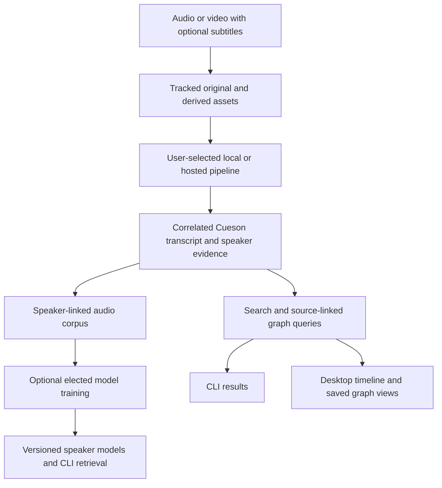

# insonic v0.0.0

insonic organizes audio and video, correlates subtitles, tracks speakers and explores what was said and when through a CLI and desktop wrapper. Replaceable local and hosted tools operate through explicit adapters while the user controls the library, configuration and processing history. Source-linked speaker audio can optionally feed trained models associated with those speakers.

v0.0.0 is a specification baseline with a source-buildable workspace/runtime CLI, durable SQLite/PostgreSQL catalogs, managed filesystem/S3 artifact storage, encrypted credentials, downloaded model acquisition, original media admission with metadata/dates, and a shared desktop bridge. It also provides configured local mapped-audio, recognition/diarization and current embedded Cueson processing. Full GUI controls, hosted processing, training engines and installable product packages remain implementation contracts.

## Read in this order

1. [Product and requirements](product.md) states the outcome and required behavior.
2. [Architecture](architecture.md) explains authority, processing and recovery boundaries.
3. [Technology decisions](technology.md) compares implementation choices and dependency qualification.
4. [Delivery outcomes](roadmap.md) explains capability dependencies.

Focused contracts cover [import dates and metadata](ingestion.md), [media](media.md), [pipelines](pipelines.md), [subtitles](subtitles.md), [speakers](speakers.md), [speaker audio and models](voice-models.md), [queries](graph.md), [storage](storage.md), [catalog structure](schema.md), [JSON contracts](contracts.md), [credentials](security.md), [credential commands](secrets.md) and [downloaded models](models.md), [desktop behavior](desktop.md) and [development](development.md). The [glossary](glossary.md) defines technical vocabulary with learning and local usage links. The [changelog](changelog.md) records changes.

## The guiding outcome

A user adds media with original metadata and optional recording dates/subtitles, selects an understandable preset and receives a searchable library. Results link to the original media position and distinguish acoustic voices, named speakers, transcript wording and extracted assertions. The CLI exposes core operations and machine-readable results; the GUI wraps the shared runtime and provides a media timeline and saved graph views. Optional speaker-model training uses a corpus of valid current evidence references without interrupting ordinary library work.

