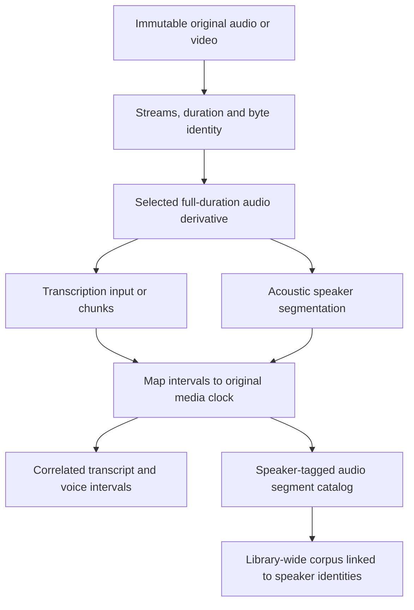

# Media and provenance

## Originals and acquisitions

Audio and video share one `MediaEntry` catalog model. A media entry represents a library item; a `MediaAsset` represents a particular byte sequence and selected streams. Content hashes identify bytes, while stable entry IDs retain user metadata and processing history. The same bytes can be associated with several entries without becoming independent evidence automatically.

Import offers Copy into library or Keep in current location. Copy is the simple default: it preserves verified original bytes in the selected filesystem/S3 artifact store and remains usable if the input moves. Reference mode avoids duplicating large local collections and reports missing or changed external files. A remote acquisition downloads to a temporary location, verifies completion and records its adapter, sanitized stable source locator, retrieval time and available publisher metadata before admission. Credentials and transient signed access URLs remain outside catalog provenance, manifests and exports. [Import, metadata and dates](ingestion.md) defines early embedded-metadata capture and explicit origination-date input before any transform.

Never edit an original in place. A changed source receives a new asset revision. Content hash and file-size checks bind admission to the inspected bytes, including detection of changes during copying. Hash equality supports deduplication; titles and durations are leads for comparison rather than proof. Users can link repeated publications into a source family without deleting originals.

## Audio derivatives

Video audio extraction, resampling, channel selection, normalization and inference chunks create derived assets. Each records its parent hash, source stream, channel layout, transform specification, tool and version, sample format, duration and mapping to original media time. Default transcription input can be optimized mono PCM at the chosen model's supported sample rate. Do not mix channels when that would destroy useful separation; let the user select or preserve channels.

Full-duration extraction retains silence and sequence by default. A chunk has an offset and bounded source interval. Silence removal or concatenation requires a piecewise time map; a single offset is insufficient. Unsupported time-remapping transforms fail explicitly rather than emitting misleading timestamps. Variable-frame-rate video uses presentation timestamps, not frame-number division by an assumed rate.

Speaker-tagged audio consumers reference the current recording/document/cue/local UUID. Resolve timed intervals and channel/source mapping from that authority instead of persisting another assignment list. Untimed participation has no exact clip interval. Managed clips are derived current data; replacing a document or correcting its known-speaker mapping invalidates affected corpus preparation and physically retires removed outputs through recoverable cleanup. The corpus spans the library, and optional training follows [speaker audio and voice models](voice-models.md).

## Time and correlation

Store media-relative integer microseconds internally; convert to Cueson's integer milliseconds using a documented rounding rule at the subtitle boundary. Preserve higher precision in the insonic correlation sidecar. Source interval boundaries must remain ordered and within the probed duration, with an explicit codec-tolerance policy. An export must not claim precision greater than its format provides.

Keep recording time, publication time, retrieval time, import time and processing time separate. Recording dates support earliest/latest bounds, precision, time zone, basis and supporting source. File modification time does not become recording time. Unknown dates remain unknown and appear in the timeline's undated group. A derived file inherits its relationship to the original clock, not a newly invented recording date.

An import-supplied timestamp without a zone uses the captured local timezone by default, with UTC/IANA/offset overrides. Current embedded observations and owner date selections remain distinct records. Refresh replaces computed metadata and retires the superseded reports; date correction preserves owner observations and the current source report. Date-only input retains its precision; corrections update calendar placement without altering media-relative timing or the original metadata. See the complete [date policy](ingestion.md#origination-dates-and-timezones).

Subtitle attachments explicitly name their media entry and stream or track. Filename proximity can suggest a match, but cannot silently choose among ambiguous media. Users can set subtitle offsets or scaling; the transform is versioned and the supplied bytes remain intact.

## Retention and export

Originals, supplied subtitles and accepted evidence are durable. Disposable decode caches are regenerable. Downloaded base models use digest-verified workspace artifact storage and exact manifests, independently of trained speaker model lineage. Trained speaker model versions and checkpoints use durable workspace artifact storage. A deletion presents affected entries/files and distinguishes removing an index entry from deleting managed bytes; an explicit deletion action can proceed without a separate repeated approval dialog. Referenced external files are never deleted by removing a library entry.

A portable workspace export includes a manifest, content-addressed managed assets or explicit missing external references, current raw metadata and selected date observations, one current embedded document per recording, external speaker/term catalogs, reference-only segment/dataset/model lineage, pipeline definitions and evidence metadata. Model binaries and corpus clips can be included or left as explicit remote/missing artifact references according to export options. It excludes credentials. Import validates portable paths and identities; it cannot rely on the exporting machine's absolute paths or provider credentials.
