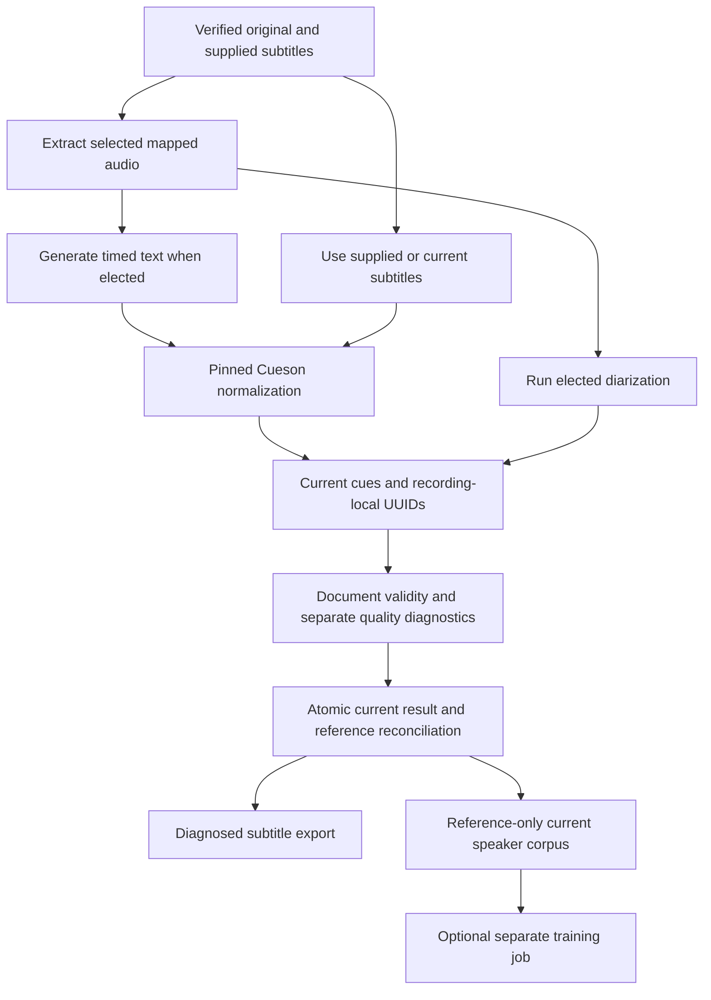
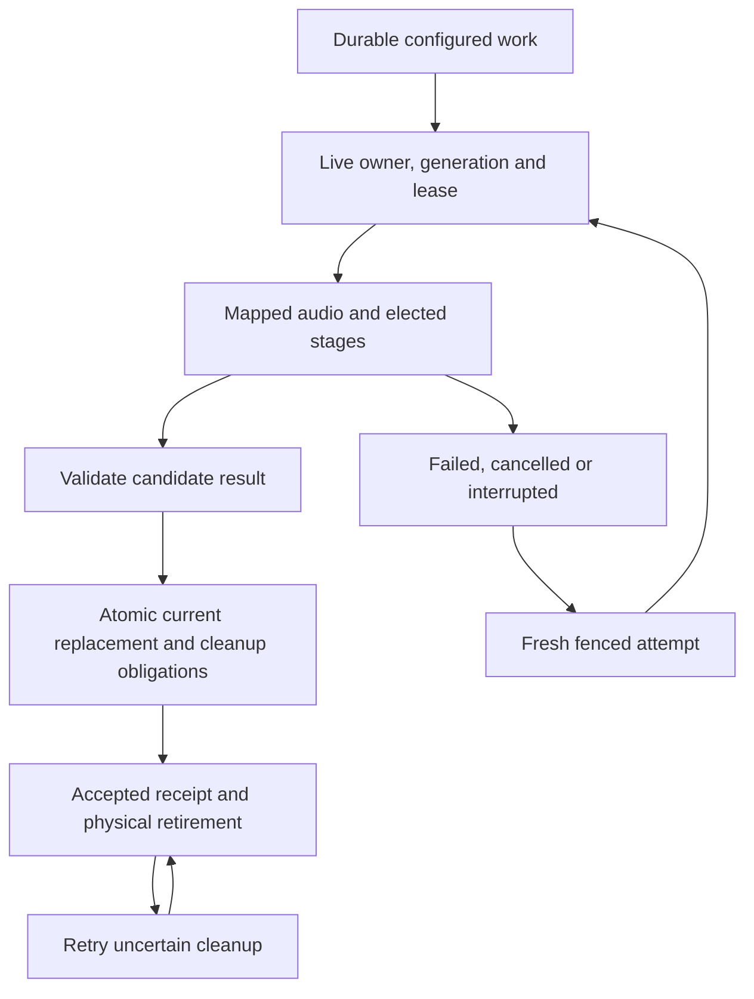

# Pipelines and adapters

## Configured work and current results

A pipeline declares elected models, adapters, device/resource settings and routing. Saved definitions can retain configuration history; processing does not retain alternative transcripts or assignment stores. Changing defaults affects future work. Rerunning a stage replaces the current result after validation and fenced acceptance. Once routing is configured, normal work proceeds without per-item approval or silent provider fallback.

Local, Connected provider and Custom presets remain the broader configuration contract. Current local processing uses managed exact model identities and separate Python environments. Connected adapters and preset controls can arrive independently without moving core behavior into the GUI.

Supplied subtitles bypass recognition. Reusing current subtitles supports diarization-only reruns; reusing current assignments requires compatibility with the new cue evidence. A supplied or generated text-only result without usable timing cannot be silently assigned invented intervals. Metadata capture precedes transforms under [ingestion](ingestion.md).

## Local processing and quality diagnostics

Mapped audio records original source digest, selected stream/channels, sample format, tool identity and exact source-time mapping. The selected local recognizer and diarizer receive verified managed model files, not an ambient latest model name. Missing or invalid models, incompatible capabilities and unsupported device selection produce actionable failure. A local failure never chooses hosted routing or another device silently.

Local workers import engine packages lazily only for elected product processing or explicit maintainer qualification. Offline execution prevents ambient model retrieval. Literal argv, protected bounded input, separate bounded output, hidden Windows creation and supervised cancellation apply to every worker. Model files are materialized under confined relative names; temporary stage output is cleaned after success, failure and cancellation.

Automatic diarization diagnostics are enabled by default and describe speech coverage, overlap, boundary/timing consistency, empty output and other declared measurements. They are separate from Cueson schema validity. A valid assignment document does not prove voice accuracy. No-speech and unusable timing remain explicit outcomes, and diagnostics do not create a manual review queue. Maintainer qualification records exact model/settings, resource use, recognized text and speaker/timing diagnostic method; it never injects reference subtitles as generated recognition output.

## Capability contracts

| Capability | Inputs | Required result |
| --- | --- | --- |
| Acquisition | Source locator and selected credential reference | Original bytes and sanitized provenance |
| Probe/derive | Exact source and transform | Stream facts or mapped audio |
| Transcription | Mapped audio, model and effective options | Actual text and timed segments, with declared diagnostics |
| Diarization | Mapped audio, model and effective options | Temporary recording-local voice turns and automatic diagnostics |
| Subtitle normalization | Supplied or generated native bytes | Current valid upstream Cue JSON |
| Speaker mapping | Recording/local UUID and known catalog speaker | External mapping without rewriting subtitle text |
| Alignment | Current text and mapped audio | Timed evidence or explicit unavailable outcome |
| Assertion extraction | Current cue references | Structured assertions citing current evidence |
| Dataset preparation | Current speaker/cue references and recipe | Mapped inputs and reference/digest provenance |
| Voice training | Valid current dataset and elected adapter | Durable model outputs and noncontent lineage |

Adapters advertise actual capabilities and protocol versions. A text-only endpoint is not an audio recognizer. Worker requests/results bind source/model/tool identities and effective settings, using managed references for large input and never credential values in argv or durable receipts.

## Durable work and recovery

Pause prevents new claims, Cancel revokes current authority and terminates supervised children, and Retry obtains a fresh fenced attempt. Acceptance checks expected current/source revisions as well as the work fence. Late results cannot replace newer accepted data. Accepted receipts carry identities/digests/diagnostics, not duplicate documents or turns.

Before acceptance, configured processing can recompute stages after interruption. Explicit assembly input is ephemeral and must be resubmitted. After acceptance, recovery reconciles the receipt and cleanup without rerunning engines. Physical retirement waits for active leases/references and retries uncertain removal without resurrecting obsolete output.

Current replacement invalidates stale segment/evidence references, dataset membership and prepared inputs rather than retaining frozen copies of old assignments. Completed model outputs and their source IDs/digests remain provenance. General scheduling, provider presets, graph assertion extraction and training engines retain their separate delivery contracts.

## Required checks and maintainer evidence

No CI suite, native/backend qualification or required status check invokes transcription/diarization, initializes or loads their models, downloads model weights or requires engine results. The rule applies even to small or cached models. Deterministic tests supply stage results at the adapter boundary and may probe/extract committed real media and execute Cueson. Actual recognition/diarization quality testing requires the explicit opt-in maintainer path outside CI and merge requirements.
