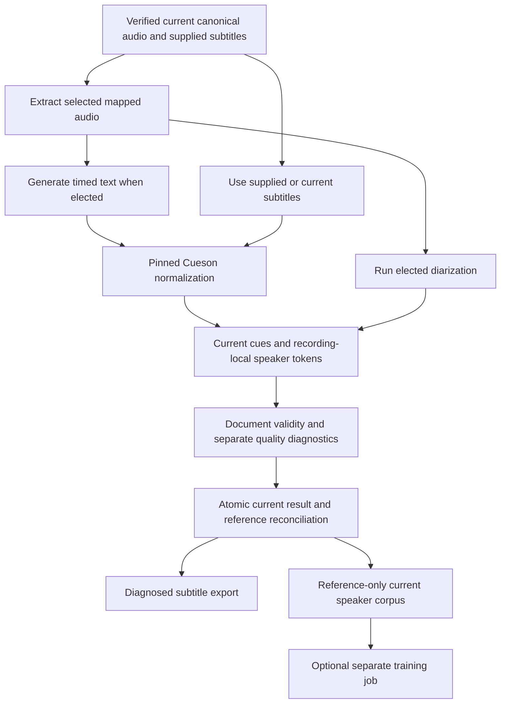
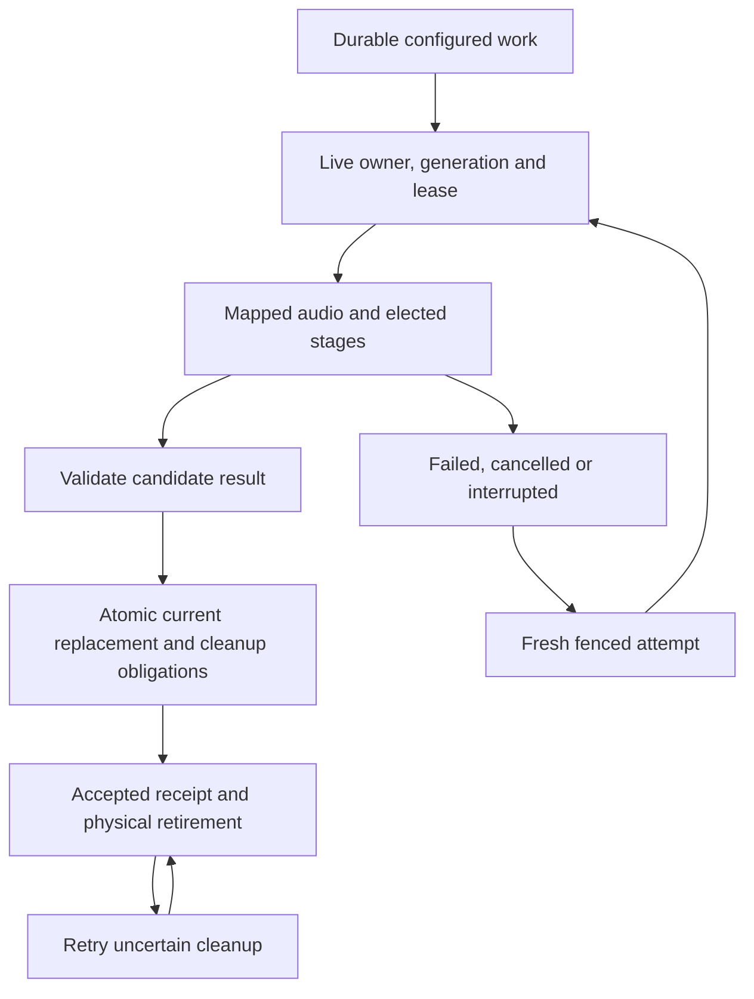

# Pipelines and adapters

## Configured work and current results

A pipeline declares elected models, adapters, device/resource settings and routing. Saved definitions advance revisions and accepted work retains its elected configuration; processing does not retain alternative transcripts or assignment stores. Changing defaults affects future work. Rerunning a stage replaces the current result after validation and fenced acceptance. Once routing is configured, normal work proceeds without per-item approval or silent provider fallback.

Saved Local, Connected and Custom pipelines use stable IDs and expected-revision updates. Local selects both local workers, Connected selects both hosted workers, and Custom supports an explicit mix. The stored values are `local`, `connected` and `custom`. Each stage declares its adapter contract, exact managed local model or remote model, options and resource limits. Inspection reports effective settings and capabilities without contacting endpoints or running models. Dedicated GUI controls follow the desktop delivery contract; the shared runtime and bridge expose every operation.



Supplied subtitles bypass recognition. Reusing current subtitles supports diarization-only reruns; reusing current assignments requires compatibility with the new cue evidence. A supplied or generated text-only result without usable timing cannot be silently assigned invented intervals. Metadata capture precedes transforms under [ingestion](ingestion.md).


## Saved definitions and command inputs

```sh
insonic pipelines list --json
insonic pipelines show PIPELINE_ID --json
insonic pipelines set PIPELINE_ID --input pipeline-update.json --json
insonic pipelines inspect PIPELINE_ID --input inspection.json --json
insonic recordings process MEDIA_ID --input processing.json --json
```

A pipeline mutation carries `expected_revision` and `pipeline`, whose fields are `id`, `name`, `preset` and `configuration`. Zero expected revision creates a new ID; a positive expected revision must match the saved record. The returned revision is authoritative. Configuration contains `recognition`, `diarization` and optional `quality`. Each supplied per-run override replaces that complete stage or quality policy; it does not merge arbitrary option keys. Inspection input is optional and accepts `revision`, `overrides` and `context`.

For example, a new local definition uses explicit managed model IDs:

```json
{
  "expected_revision": 0,
  "pipeline": {
    "id": "66666666-6666-4666-8666-666666666666",
    "name": "Local speech",
    "preset": "local",
    "configuration": {
      "recognition": {
        "adapter": "faster-whisper",
        "contract_version": "1",
        "mode": "local",
        "model_id": "11111111-1111-4111-8111-111111111111"
      },
      "diarization": {
        "adapter": "pyannote",
        "contract_version": "1",
        "mode": "local",
        "model_id": "22222222-2222-4222-8222-222222222222"
      }
    }
  }
}
```

Local `model_id` fields accept exact base installation UUIDs, `base:UUID`, short workspace aliases and `source:NAME/SELECTOR` references. Saving or inspecting a definition performs no model acquisition or inference. Processing resolves the references once, validates the selected adapter contract and complete file layout, and freezes exact model identities before acquisition. Registered compatible models can be selected before their bytes are available.

Recording processing can elect `pipeline_id`, optional `pipeline_revision`, `overrides` and speaker/language/context filters. Submission freezes the saved revision, normalized effective configuration, selected nonsecret tool identities, local model manifest digests and compiled recognition hints. Missing elected bundles acquire through shared durable work; dependent processing waits without occupying an inference worker slot. Work inspection identifies acquisition dependencies separately from processing. Execution revalidates each elected local manifest digest and verified bytes. Alias, source and pipeline edits affect future submissions; retry retains the original election. Recognition and diarization reuse still follow current-document compatibility rules. Omitting a pipeline retains direct `recognition_model_id` and `diarization_model_id` inputs with the same reference syntax. Import's explicitly elected diarization also freezes its model identity. See [model selection and acquisition](models.md).

Entity lists accept optional JSON input with `after_id` and `limit` (1 through 100), and return `items` and `next_id`. Every command accepts the normal workspace, request-ID and JSON-output options. [JSON contracts](contracts.md) describe exact worker and configuration fields.

## Hosted worker contract

The `insonic-http` adapter uses contract version `1`. An operator configures the endpoint, remote model, declared transcription/diarization capabilities, supported hint budget and optional opaque credential ID. It sends one multipart POST containing a `request` JSON field and an `audio` field with the selected mapped WAV. The request identifies contract version, operation, model and effective options. The recognition response contains timed text segments; the diarization response contains voice turns. Both use integer mapped-audio-relative microseconds and an explicit `no_speech` result. The runtime validates bounds and projects results onto the original source clock before assembly.

An arbitrary provider API is not automatically compatible with this worker protocol. Provider-specific services can implement it through an adapter. Endpoint inspection validates configuration but reports reachability as not probed. Execution resolves only the elected credential and sends it as a Bearer authorization header. Redirects are refused; endpoint user information, query strings and fragments are rejected. Credentials require HTTPS, with an explicit loopback HTTP exception for locally hosted services. Errors return fixed categories without provider response bodies, credential values or endpoint details.

Local and hosted stages both use bounded audio, response and timeout settings. Omitted limits normalize to 128 MiB audio, 16 MiB response and 600000 milliseconds; explicit limits are validated before submission. A route or capability failure does not choose another provider, model or device.

## Local processing and quality diagnostics

Mapped audio records original source digest, selected stream/channels, sample format, tool identity and exact source-time mapping. The selected local recognizer and diarizer receive verified managed model files, not an ambient latest model name. Missing or invalid models, incompatible capabilities and unsupported device selection produce actionable failure. A local failure never chooses hosted routing or another device silently.

Local workers import engine packages lazily only for elected product processing or explicit maintainer qualification. Offline execution prevents ambient model retrieval. Literal argv, protected bounded input, separate bounded output, hidden Windows creation and supervised cancellation apply to every worker. Model files are materialized under confined relative names; temporary stage output is cleaned after success, failure and cancellation.

Automatic diarization diagnostics are enabled by default and describe speech coverage, overlap, short turns, boundary/timing consistency and empty output. The quality policy can set minimum speech coverage, maximum overlap fraction and a short-turn threshold, or disable these optional checks. They are separate from Cueson schema validity. A valid assignment document does not prove voice accuracy. Reused diarization quality is recomputed from current embedded millisecond assignments and the current source map; its provenance names that quantized current-document basis rather than implying a fresh acoustic engine run. No-speech and unusable timing remain explicit outcomes, and diagnostics do not create a manual review queue. Maintainer qualification records exact model/settings, resource use, recognized text and speaker/timing diagnostic method; it never injects reference subtitles as generated recognition output.

## Capability contracts

| Capability | Inputs | Required result |
| --- | --- | --- |
| Acquisition | Source locator and selected credential reference | Original bytes and sanitized provenance |
| Probe/derive | Exact source and transform | Stream facts or mapped audio |
| Transcription | Mapped audio, model and effective options | Actual text and timed segments, with declared diagnostics |
| Diarization | Mapped audio, model and effective options | Temporary recording-local voice turns and automatic diagnostics |
| Subtitle normalization | Supplied or generated native bytes | Current valid upstream Cue JSON |
| Speaker mapping | Recording/local speaker token and known catalog speaker | External mapping without rewriting subtitle text |
| Alignment | Current text and mapped audio | Timed evidence or explicit unavailable outcome |
| Assertion extraction | Current cue references | Structured assertions citing current evidence |
| Dataset preparation | Current speaker/cue references and recipe | Mapped inputs and reference/digest provenance |
| Voice training | Valid current dataset and elected adapter | Durable model outputs and noncontent lineage |

Adapters advertise actual capabilities and protocol versions. A text-only endpoint is not an audio recognizer. Worker requests/results bind source/model/tool identities and effective settings, using managed references for large input and never credential values in argv or durable receipts.

## Durable work and recovery



Pause prevents new claims, Cancel revokes current authority and terminates supervised children, and Retry obtains a fresh fenced attempt. Acceptance checks expected current/source revisions as well as the work fence. Late results cannot replace newer accepted data. Accepted receipts carry identities/digests/diagnostics, not duplicate documents or turns.

Before acceptance, configured processing can recompute stages after interruption. Explicit assembly input is ephemeral and must be resubmitted. After acceptance, recovery reconciles the receipt and cleanup without rerunning engines. Physical retirement waits for active leases/references and retries uncertain removal without resurrecting obsolete output.

Current replacement invalidates stale segment/evidence references, dataset membership and prepared inputs rather than retaining frozen copies of old assignments. Completed model outputs and their source IDs/digests remain provenance. Graph assertion extraction and optional query assistance use elected versioned HTTP adapters. General scheduling and training engines retain their separate delivery contracts.

## Required checks and maintainer evidence

No CI suite, native/backend qualification or required status check invokes transcription/diarization, initializes or loads their models, downloads model weights or requires engine results. The rule applies even to small or cached models. Deterministic tests supply stage results at the adapter boundary and may probe/extract committed real media and execute Cueson. Actual recognition/diarization quality testing requires the explicit opt-in maintainer path outside CI and merge requirements.

## Current evidence extraction

Evidence extraction operates on accepted current Cue JSON through the shared durable-work runtime. The builtin cue-statement adapter preserves literal source ownership; an explicitly configured HTTP adapter can supply propositions with cue citations, polarity, modality and conditions. Acceptance validates current recording revision, document digest and cited local voices. Replacement invalidates that extraction. [Graph operations](graph.md) document executable inputs, bounds and provenance. Required CI exercises deterministic supplied replies and never initializes models.
