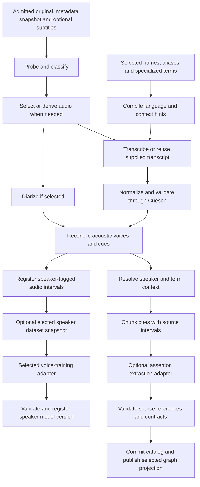
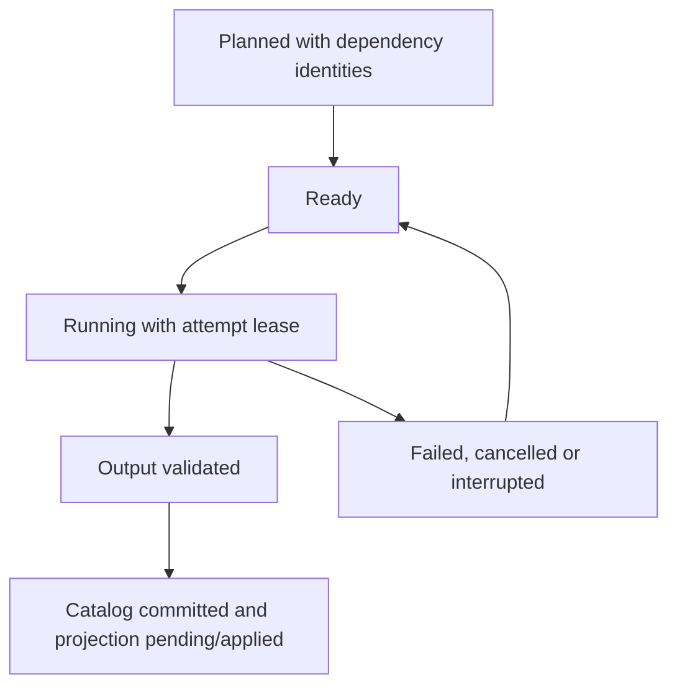

# Pipelines and adapters

## Simple choices and advanced controls

Offer Local, Connected provider and Custom presets. Setup asks what the user wants to process, their preferred privacy/cost tradeoff, and an optional provider credential. The application explains required downloads and hardware choices in ordinary language. Advanced configuration exposes individual stages and endpoints. A saved pipeline is an immutable revision with explicit model, provider, options and credential references for every routed stage.

Changing the default affects future jobs. An existing job retains its original pipeline snapshot. Users can rerun selected stages with a new revision and compare outputs before changing the selected transcript. Installing a remote provider is not required for local transcription or direct queries. Once a preset and its routing are configured, normal stages proceed without per-item approval. Automatic selection of valid outputs and supported speaker mappings is a configurable policy with revision history and correction; comparison views remain available on demand.

Stages can be skipped when valid matching output exists. A supplied subtitle track can bypass recognition while still requiring normalization and, when selected, acoustic diarization. Music or ambient classification skips automatic speech work by default and remains user-overridable. Assertion extraction is unnecessary for word search; the library exposes the simpler result while semantic indexing is pending.

Metadata capture is an admission step from [ingestion](ingestion.md), preceding this derived pipeline. Corpus registration runs after valid diarization/attribution without requiring voice training. Training is a separate elected job against an immutable dataset snapshot; it never becomes a prerequisite for transcription, search or speaker editing. Future snapshots can use automatically selected matching segments under the saved policy, without approving every segment. [Speaker model contracts](voice-models.md) define preparation, checkpoints, results and lineage.

## Capability contracts

| Capability | Inputs | Required result |
| --- | --- | --- |
| Acquisition | URL/source locator and selected credential reference | Original bytes and acquisition provenance |
| Probe/derive | Exact media asset and transform | Stream facts or mapped derivative |
| Transcription | Mapped audio, language, ordered context terms | Text and timed segments, optional words and confidence |
| Diarization | Mapped audio and segmentation options | File-local voice intervals and overlap information |
| Alignment | Audio and selected transcript revision | Timed observations without replacing text silently |
| Subtitle normalization | Supplied or deterministically generated subtitle bytes | Valid official Cue JSON, reports and rendered subtitles |
| Assertion extraction | Source-owned cue chunks and attribution | Structured assertions with exact cited evidence |
| Embedding | Explicit text/audio inputs and model identity | Versioned vectors with scope and provenance |
| Query assistance | User request and selected schema/context | Suggested query and explanation |
| Speaker dataset preparation | Speaker ID, segment selection revision and recipe | Immutable segment manifest, mapped audio/text artifacts and diagnostics |
| Voice model training | Dataset snapshot, compatible base model and settings | Run/checkpoint receipts and validated speaker model version artifacts |

An adapter advertises the capabilities it actually supplies. A text-only LLM endpoint cannot be selected as an audio recognizer merely because it accepts chat messages. Prefer explicit task-level capability negotiation, contract versions and readable compatibility errors.

The worker protocol uses JSON requests/results plus structured progress events. Record protocol version, request ID, job ID and attempt, full input digests, model revision, effective settings and output digests. Large inputs are local artifact references or bounded uploaded streams, not giant command-line arguments. Subprocesses receive literal argument arrays, closed noninteractive stdin when unused, hidden Windows creation flags and bounded output. Secrets travel through a dedicated input channel or protected environment only when needed and never through argv.

## Durable scheduling

A scheduler limits CPU, GPU, disk and provider concurrency. Default GPU slots prevent model workers competing for the same memory; users can tune limits. Pause stops new claims, Cancel revokes a running attempt and terminates supervised workers, and Retry creates a new attempt. Late results from a revoked attempt cannot overwrite current data.

Job identity includes source hash, derivative map, selected transcript revision, adapter/model identity, exact effective terms and options. Changing speaker terms invalidates the affected guided transcription or attribution stages, not unrelated decode work. Training identity additionally binds the dataset manifest, speaker-attribution revisions, base-model digest, training adapter/options and seed where supported. A valid cached result can be republished after graph failure without rerunning AI. Catalog, artifact and graph adapters are separate from model task adapters; their [portable contracts](schema.md) carry the same provenance.

Provider retries distinguish transient network failure from authentication and quota failures. Preserve provider request IDs and cost/usage summaries when available, without logging request content by default. Pipeline configuration states what data each hosted stage sends. No automatic fallback uploads local media to a provider the user did not choose.
