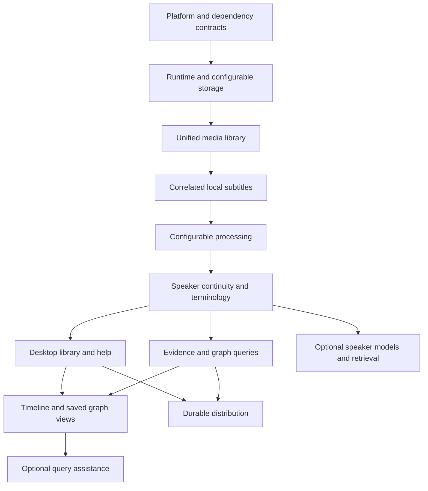

# Delivery outcomes

Delivery follows the dependencies between usable capabilities. GitHub Issues, milestones and the Project track implementation progress; this page explains how the product outcomes build on each other.

| Outcome | Result | Depends on |
| --- | --- | --- |
| Platform and dependency contracts | Native CLI/runtime and desktop communication, pinned Cueson and graph libraries, hidden process launch, encrypted secrets and offline help on Windows, macOS and Linux | Shared application contracts |
| Runtime and configurable storage | Workspace ownership, durable jobs, migrations, model registry and complete filesystem/S3 and SQLite/PostgreSQL behavior | Platform contracts |
| Unified media library | Audio/video import, original identity, raw metadata capture, recording dates, per-item batch inputs and relocation | Runtime and storage |
| Correlated local subtitles | Supplied subtitle tracks, mapped audio derivatives, local recognition, source-timed speaker intervals and Cueson artifacts | Media library |
| Configurable processing | Readable presets, task capabilities, local/hosted routing and per-stage overrides | Subtitle and job contracts |
| Speaker continuity and terminology | Voices, names, aliases, reversible attribution, library-wide audio selection and transcription context | Processing and source-timed intervals |
| Desktop library and help | GUI packages that include the CLI, common core operations, playback, progress and release-matched offline docs | Runtime, media and speaker contracts |
| Evidence and querying | Chunked source assertions, ordered LadybugDB/ArcadeDB projection and source-linked word/speaker/time queries | Subtitle and speaker contracts |
| Visual exploration | Calendar/media timeline, saved force-directed graph views and keyboard/table alternatives | Desktop and graph queries |
| Optional query assistance | Configured model suggestions and elected validated read-only execution | Processing and query contracts |
| Durable distribution | Portable backups, expanded acquisition, signed packages and synchronized release/docs/schema publication | Installable packages and recovery contracts |
| Optional speaker models | Immutable corpus snapshots, elected training, versioned speaker-associated artifacts and CLI discovery/retrieval | Runtime, processing and speaker contracts |

CLI operations establish the application contract before their desktop controls. Installing the GUI includes the CLI. Core feature parity is the goal; matching release documentation identifies any advanced or experimental CLI capabilities awaiting GUI controls.

Optional speaker training can proceed once speaker, corpus and adapter contracts exist, alongside graph and desktop work. It does not require completion of every visual or distribution feature. A platform experiment can change a framework, dependency pin or packaging method while preserving the three required operating systems and supported backend behavior.

Direct library access and querying do not require an AI account or a model download. Training and query assistance are elective. Users' observations after releases become focused corrective work through the same issue-driven workflow.
