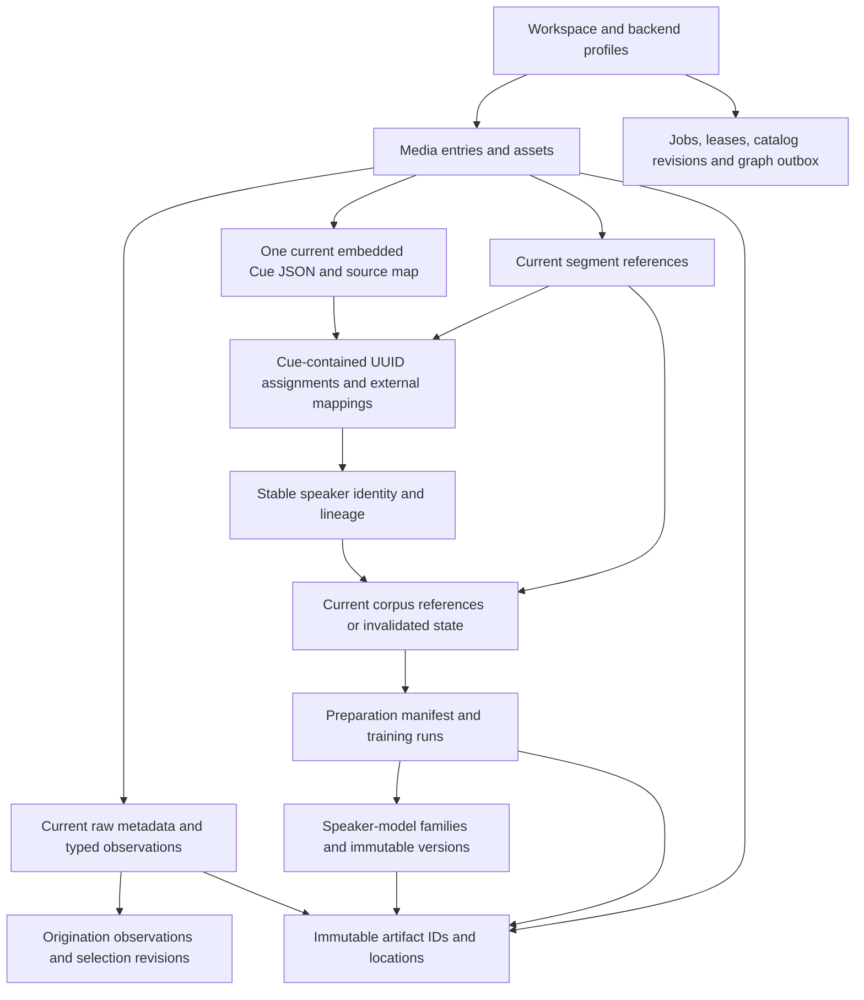

# Storage and catalog schema

## Logical contract and authority

The SQLite and PostgreSQL catalog adapters implement this logical schema. Application functions operate on typed records through the [catalog adapter](storage.md#catalog-adapter-and-postgresql-ownership); SQL syntax, connection management and migrations stay inside that adapter. Both official backends implement every catalog record and operation. The selected LadybugDB or ArcadeDB graph is a projection of this authority, not the only repository of media, speaker or trained-model lineage. [JSON contracts](contracts.md) define the versioned interchange payloads around these records.

Every workspace-scoped row carries `workspace_id` and a stable application-generated ID. Foreign keys and uniqueness include workspace scope so a relationship cannot accidentally cross workspaces. IDs use one documented UUID text representation at the application boundary; adapters may use compatible native storage. Never use SQLite row IDs, PostgreSQL sequences or graph record IDs as public identity. Mutable selections/settings have increasing revisions and expected-revision checks. Original source assets remain immutable. Computed current evidence is atomically replaced; accepted receipts retain identities and hashes without preserving obsolete documents or assignments.

Byte identity, media identity and speaker identity are separate. A SHA-256 digest identifies immutable content; a media entry is a user-facing library item; a speaker is a catalog identity with correction history. Equal bytes can serve several entries, and a speaker can have many model families/versions without being equated with a model file.

## Portable values and invariants

Catalog schema 5 adds revisioned saved pipelines, canonical speaker state and aliases,
scoped terminology and context-selection provenance to the current embedded
recordings, external mappings and reference-only corpus evidence.
The current library's nullable `duration_us` is authoritative: null means unknown
and zero means a measured zero. Existing numeric source-asset duration fields
remain for snapshot compatibility and never supply a fallback for unknown current
media duration. Historical schema-1/schema-2/schema-3/schema-4 migration definitions remain frozen. Legacy speakers retain their stable IDs and names; aliases and terms are not guessed from old assignment data.

Current facts, metadata and dates are replaced atomically. Operational receipts
retain identities and record hashes, rather than an archive of superseded
computed values. Physical cleanup removes only report publications authorized by
the accepted replacement; active readers delay success until their leases end.
Original and supplied subtitle source assets remain retained. Exports include
current data and expire imported running authority on restore.

| Value | Logical representation and rule |
| --- | --- |
| IDs | Stable UUID text; explicit workspace scope and foreign keys |
| Revision | Positive signed 64-bit integer, monotonically increasing within its entity/stream |
| Audit instant | Cueson-compatible `{ "iso": "2026-10-04T18:30:00Z", "unix_ns": 1791138600000000000 }`; RFC 3339 text and Unix nanoseconds represent the same instant |
| Media interval | Original-clock integer microseconds, half-open `[start, end)`, ordered and duration-validated |
| Cue interval | Cueson integer milliseconds with exact source mapping outside the document; deliberate inward projection |
| Origination time | Literal wall time/date, zone/offset and policy, precision and optional UTC instant/bounds; unknown remains null |
| Content identity | SHA-256 hex plus byte length; transport ETag/version ID stored separately |
| Structured options | Versioned, canonical JSON with typed validation and deterministic digest; no credentials |
| Status | Documented textual values with backend check constraints or equivalent validation; no backend enum dependency |
| Numbers/booleans | Identical range/null semantics at adapter boundaries; do not depend on SQLite affinity coercion |
| Ordered membership | Explicit ordinal and stable IDs; query order is never assumed without ordering |

Absolute timestamps use the [Cueson timestamp format](https://github.com/shruggietech/cueson/blob/v1.2.0/internal/schema/cueson.schema.json): `iso` contains RFC 3339 text and `unix_ns` contains the exact Unix-epoch nanosecond count for the same instant. Audit output uses UTC. The application validates agreement between both values; structural schema validation alone cannot prove it. Import wall-time literals retain their separate timezone and uncertainty rules, and media-relative intervals use the units defined above.

Catalog adapters preserve the exact nanosecond value; a PostgreSQL timestamp column alone cannot preserve nanosecond precision. Native runtimes and JSON consumers use lossless integer parsing and serialization. The desktop wrapper displays `iso` and passes exact timestamp payloads through the shared runtime rather than converting `unix_ns` through a JavaScript floating-point number.

Use non-null references for required provenance. An unknown value differs from an empty string, zero or a guessed default. Portable JSON is not a substitute for relational foreign keys on core associations. Store commonly queried properties in typed columns; preserve complete vendor reports/options in versioned JSON or artifact manifests. Backend-specific JSON, full-text and index facilities may optimize operations only if the normalized results stay equivalent.

Primary uniqueness includes artifact digest/size within the deduplication scope, entity/revision pairs, job idempotency keys, dataset/member ordinal, outbox event ID and graph target checkpoint. Duplicate cue text is not a unique identity. Deletion must obey explicit retention rules; a speaker correction invalidates dependent current preparation while retaining canonical sources and captured provenance and noncontent model lineage. Hard deletion of referenced durable artifacts fails until the user-requested retention operation has reconciled those references.

## Workspace, artifacts and media

| Record | Required relationships and fields |
| --- | --- |
| `workspace` | ID, logical/catalog schema versions, current revision, backend profile IDs and lifecycle state |
| `backend_profile_revision` | Role, adapter ID/contract version, immutable nonsecret config, credential IDs, capabilities and validation result |
| `artifact` | ID, SHA-256, size, kind, creation/producer provenance, durable retention class and lifecycle/retirement generation |
| `artifact_location` | Artifact/profile IDs, managed filesystem key or S3 bucket/key/version, availability and publication receipt; no signed URL |
| `artifact_verification` | Artifact/location IDs, verified digest/size, method, time and verification result |
| `materialization_lease` | Artifact/location and attempt IDs, local cache path, verification, owner and expiry; disposable local state |
| `import_batch` / `import_item` | Manifest/preset revision, ordered source inputs, captured timezone policy, per-item options, outcome and admitted media/asset IDs |
| `acquisition_receipt` | Sanitized stable locator, adapter/version, retrieval/import instants, original digest and available acquisition-metadata artifact |
| `media_entry` | Stable library ID, title/classification, current metadata/date/transcript selections and lifecycle revision |
| `media_asset` | Artifact ID, original/derived role, source clock/duration and admission/processing provenance |
| `media_entry_asset` | Entry/asset IDs, role and selected stream/track association; several entries can reference one asset |
| `asset_stream` | Asset ID, stable stream identity/index, media kind, codec, language, sample/channel/layout facts and probe snapshot |
| `asset_derivation` | Output asset, ordered input asset/stream IDs, transform/run/version/options and immutable map/receipt artifacts |
| `time_map_piece` | Derivation ID, ordinal, source asset/stream interval, derived interval and exact rate/offset semantics |

Artifact locations are separate from byte identity so provider migration does not rewrite current document identities, valid corpus references or model versions. An artifact may have several verified locations; a local materialization is not automatically a durable replica. Unavailable external bytes retain the admitted identity and an explicit changed/missing state. A newly changed external source requires a new asset; it does not redefine the original digest.

The time map can represent extraction, resampling, trimming and concatenation. Each piece names its original source clock; a concatenated training input cannot claim a single offset if it contains disjoint intervals. Stream selection and channel provenance remain explicit. Supplied subtitle bytes use artifact records with a media/track attachment, not filename-based implicit ownership.

## Early metadata and origination dates

`MediaMetadataSnapshot`, `MetadataObservation` and `OriginationDateObservation` are the conceptual names; the records below use consistent snake_case. [Ingestion](ingestion.md) defines capture and precedence before any media transformation.

| Record | Required information |
| --- | --- |
| `media_metadata_snapshot` | Input item/source asset, inspected digest, raw report/payload artifact IDs, extractor/version/options, capture time, format coverage and warnings |
| `metadata_capture_attempt` | Snapshot/source identity, capture state, stage outcome and retry linkage |
| `metadata_observation` | Snapshot, qualified family/group/tag/path and duplicate instance, raw value/reference, typed normalized value, units, precision and interpretation method |
| `mime_resolution_revision` | Asset, extension/acquisition/byte/extractor/probe observation IDs, chosen preferred MIME, resolver/version, disagreements and optional owner override |
| `origination_date_observation` | Entry/asset, owner or embedded basis, supporting observation, entered/raw literal, zone source, IANA zone or fixed offset, resolved offset, timezone-database version, precision, assumption flags and optional UTC instant/bounds |
| `origination_date_selection_revision` | Entry, selected observation or explicit unknown, precedence/policy version, reason, expected prior revision and creation instant |

Capture states are `captured`, `no-embedded-metadata`, `partial`, `unsupported` and `failed`. Only successful extraction with no embedded fields establishes `no-embedded-metadata`. An extraction failure can have no report artifact while still retaining its attempt and original source. Partial reports describe omissions and retain original bytes for retry. Raw reports and normalized observations describe the current capture. Refresh atomically replaces computed metadata and queues physical removal of superseded reports. Original media and supplied subtitle assets remain immutable. Owner edits add date observations or selection revisions without rewriting source tags.

Store the input's wall-time literal and its resolved interpretation. Local time is resolved once at import and retains the actual zone/offset and timezone rules version. A date-only value has date precision and calendar bounds where resolvable, not an invented midnight recording instant. Ambiguous or invalid daylight-saving values retain an unresolved interpretation until the affected observation is disambiguated. Another machine never reinterprets old records using its current local timezone.

Keep recording/origination, publication, retrieval, import, filesystem modification and processing observations distinguishable. The selected recording date can be unknown even when other timestamps exist. Date corrections advance only the selection revision and affected calendar projection; they do not rewrite original tags or media-relative cue/segment times.

## Pipelines, current recordings and evidence

| Record | Required relationships and fields |
| --- | --- |
| `current_pipeline` | Stable ID, display name, Local/Connected/Custom preset, current revision and typed recognition/diarization/quality configuration |
| `speaker` / `speaker_alias` | Stable canonical identity, state and aggregate revision; alternate text with explicit owner ID, language/scope/state and provenance |
| `context_term` | Stable term ID/revision, canonical/variant spellings, language/context/state and optional speaker/alias links |
| `processing_run` | Source/model/tool digests, effective settings, work fence and noncontent accepted result references |
| `recording` | Library entry/source digest, current revision/state, sole embedded Cue JSON and document digest, measured nullable duration, current mapped-audio publication and exact source map |
| `recording_roster` / `roster_member` | Independent positive header/member revision, stable library parent and unique centralized speaker references; undeclared and empty are distinct |
| `recording_speaker_mapping` | Recording/document identity, local speaker token, known speaker ID and expected current recording and mapping revisions |
| `segment` | Recording/document/cue/local-UUID references and optional current clip artifact; no copied interval/channel/known-person assignment |
| `speaker` / `speaker_identity_revision` | Stable known-speaker identity, name/attributes and current identity state |
| `speaker_alias` / `speaker_lineage_event` | Alias provenance and identity merge/split relationships |
| `term_revision` / `term_speaker_association` | Specialized terms, pronunciation/context and explicit speaker links |
| `evidence_chunk` / `assertion_revision` | Current recording/document/cue references, extraction provenance and explicit current/invalidated state |

Only the embedded Cue JSON stores recording-local assignments. Native source labels remain separate upstream observations. External known-speaker corrections preserve document text and bytes. Segment/query/playback/training consumers resolve current cue/token references rather than freezing another assignment list. Audio replacement removes stale acoustic segment/dataset membership references and invalidates dependent preparation/evidence even when document bytes are kept. Declared roster membership has its own revision and is retained or cleared only by its explicit election. Historical receipts retain IDs/digests/diagnostics without copied documents or turn arrays.

Unknown duration is null, known zero remains zero, and full media duration is measured independently of cue coverage. Preserve exact original-clock integer/rational mapping outside Cue JSON; deliberately project the consumer millisecond representation under [subtitles](subtitles.md#exact-source-time-and-millisecond-projection).

## Speaker corpus and trained models

| Record | Required relationships and fields |
| --- | --- |
| `training_selection_recipe_revision` | Speaker scope, current evidence filters and effective preparation/diagnostic settings |
| `dataset` / `training_dataset_member` | Current recording/document/cue/local-UUID membership, source digests, manifest identity and current/invalidated state |
| `training_preparation_manifest` | Valid current membership, processing/settings digest and prepared input/time-map references |
| `training_run` | Dataset/preparation identity, originating speaker, durable attempt and adapter/model/settings provenance |
| `training_checkpoint` | Run/attempt, durable output artifact or hosted handle, format and resume compatibility |
| `speaker_model` / `speaker_model_version` | Originating speaker/run/source lineage, output identities, current/invalidated manifest state and declared compatibility |
| `speaker_model_association_revision` | Current known-speaker association without changing output provenance |

Dataset and model provenance can retain source identities and hashes. It cannot preserve obsolete assignments or frozen subtitle text. Document replacement removes affected segment memberships; mapping correction invalidates affected selection while preserving the document. Invalidated dataset/run/model records clear obsolete derived manifest/preparation references and copied options, then queue their removed managed publications for physical retirement. Current corpus reuse requires rebuilding valid preparation. Original sources and durable completed model weights/checkpoints retain their independent provenance.

Downloaded base models, trained models, embeddings and provider handles are separate kinds. A provider-only version names its sanitized stable handle and actual retrieval capability, without inventing a digest for unavailable weights. Credentials remain local references. Fetching an exact supported output never substitutes a default model silently. Elected training and roster-constrained matching use the shared [speaker-model runtime](voice-models.md).

Catalog schema 9 adds immutable speaker outputs, revisioned exact current profiles and durable checkpoint records. A training run links to actual durable work. Mapping origin distinguishes manual corrections from automatic results; legacy independently confirmed mappings become manual. Schema-8 migration definitions remain frozen. Portable restore validates receipt proofs, output/publication relationships and current evidence, while source corrections retire obsolete matching payloads and assignment-bearing inputs.

## Durable jobs, outbox and queries

| Record | Required information |
| --- | --- |
| `job` / `job_attempt` | Idempotency key, effective input/options references, lifecycle state, owner claim/generation, cancellation and retry history |
| `workspace_lease` | Workspace/role key, owner ID, increasing generation, expiry and renewal state |
| `catalog_revision` / `operation_receipt` | Accepted change sequence, operation ID and committed entity revisions |
| `graph_outbox_event` | Workspace/target, consecutive target event sequence and predecessor, exact catalog revision, immutable payload/digest, operation ID, claim/generation and outcome |
| `graph_projection_target` / `graph_checkpoint` | Adapter/profile/schema, installed projection generation, applied target sequence/catalog revision, event receipt and pending/rebuild state |
| `saved_query` / `saved_query_revision` | Stable query ID, normalized QuerySpec or native text/dialect, typed parameters, schema/backend/capability validation and title |
| `saved_graph_view_revision` | Query revision, display settings, separate layout positions, without result snapshots |
| `retention_operation` / `backup_manifest` | Explicit scope, reference checks, catalog revision, artifact/version manifest and recovery outcome |

Lease generations fence long-running work; expected revisions fence user edits. Outbox events are immutable by operation/revision, with claim/outcome state tracked separately. Allocate gap-free event sequences per projection target in the accepting catalog transaction. Apply only the next sequence using a predecessor/generation compare-and-set with facts and exact event receipt in one graph transaction; event 11 cannot discard unapplied event 10 merely because its catalog revision is newer. A new owner installs its higher generation atomically in the graph checkpoint before publishing, preserves the committed sequence and reconciles already committed receipts. Catalog acknowledgements use the current lease generation separately. A graph rebuild selects a recorded catalog revision and replays its accepted evidence. Query/view revisions identify dialect compatibility after backend migration; incompatible native text remains stored with a reason.

Artifact retirement is a catalog operation with an expected lifecycle generation. Atomically claim retirement, verify retention references/active leases and prevent new durable-reference admission or materialization claims before deleting physical locations. A cleanup worker deletes only the claimed key/version/generation, reconciles an unknown result, then records completion. New writers wait, cancel retirement under the current generation or publish a new verified location rather than race a checked-but-not-yet-deleted object. Do not reuse an S3 key while an earlier deletion can still complete; use immutable unique keys or exact object versions. Filesystem publication/deletion shares the runtime's lifecycle lock. Historical identity/provenance survives deliberate byte removal with explicit missing/retired availability.

## Adapter acceptance and migration

SQLite/PostgreSQL migrations preserve foreign keys, unknown/precision values, metadata capture states, workspace isolation, current-result replacement receipts, speaker lineage, valid or explicitly invalidated dataset/model references, job claims, stale-worker fencing, idempotent operation reconciliation, outbox replay and consistent export/restore. Shared fixtures compare application results, including JSON/nulls and deterministic ordering. Backend-specific indexes and queue locks optimize operations without changing the contract.

Artifact-store migration copies and verifies bytes/locations before switching selected profiles. Catalog migration transfers typed records and validates all constraints at a paused revision. Graph migration rebuilds from catalog evidence and revalidates saved queries. Cross-store operations use the recovery contracts above. Interruptions retain a recoverable old authority and explicit pending state rather than activating a partly copied workspace. Release packages declare their supported database/server versions.

Catalog schema 7 adds declared roster domains and the truthful `untranscribed` state. Startup migration widens current-state representation and retains normal logical export/restore integrity; it does not convert media bytes. Portable roster proofs contain IDs and digests, while current membership remains in typed catalog records.

Catalog schema 8 adds revisioned model aliases and configured sources. Alias tombstones preserve remove/recreate concurrency fences; targets distinguish exact base installations, speaker versions and hosted handles. Processing/import work records preserve frozen model selections and shared acquisition dependencies. Schema-7 catalogs and snapshots retain their frozen migration/proof compatibility. Export preserves target relationships, source and alias revisions and opaque credential IDs, while excluding secret values and machine-specific materialization paths. Restored work must resolve its configured credentials in the destination workspace; it cannot silently change the selected model or inference route.
