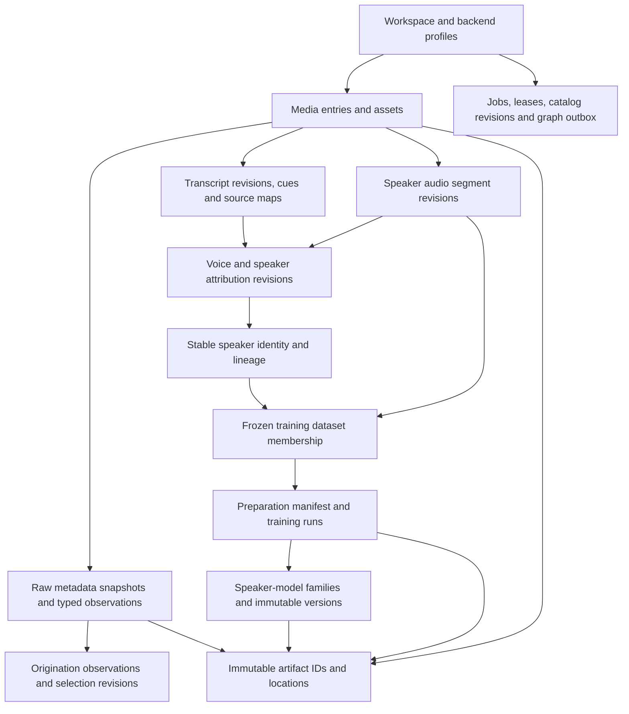

# Storage and catalog schema

## Logical contract and authority

The SQLite and PostgreSQL catalog adapters implement this logical schema. Application functions operate on typed records through the [catalog adapter](storage.md#catalog-adapter-and-postgresql-ownership); SQL syntax, connection management and migrations stay inside that adapter. Both official backends implement every catalog record and operation. The selected LadybugDB or ArcadeDB graph is a projection of this authority, not the only repository of media, speaker or trained-model lineage. [JSON contracts](contracts.md) define the versioned interchange payloads around these records.

Every workspace-scoped row carries `workspace_id` and a stable application-generated ID. Foreign keys and uniqueness include workspace scope so a relationship cannot accidentally cross workspaces. IDs use one documented UUID text representation at the application boundary; adapters may use compatible native storage. Never use SQLite row IDs, PostgreSQL sequences or graph record IDs as public identity. Mutable selections/settings have increasing revisions and expected-revision checks. Immutable evidence records are append-only; correction creates a new observation/revision and changes the selected pointer.

Byte identity, media identity and speaker identity are separate. A SHA-256 digest identifies immutable content; a media entry is a user-facing library item; a speaker is a catalog identity with correction history. Equal bytes can serve several entries, and a speaker can have many model families/versions without being equated with a model file.

## Portable values and invariants

| Value | Logical representation and rule |
| --- | --- |
| IDs | Stable UUID text; explicit workspace scope and foreign keys |
| Revision | Positive signed 64-bit integer, monotonically increasing within its entity/stream |
| Audit instant | Cueson-compatible `{ "iso": "2026-10-04T18:30:00Z", "unix_ns": 1791138600000000000 }`; RFC 3339 text and Unix nanoseconds represent the same instant |
| Media interval | Original-clock integer microseconds, half-open `[start, end)`, ordered and duration-validated |
| Cue interval | Cueson integer milliseconds plus retained microsecond correlation; one documented rounding rule |
| Origination time | Literal wall time/date, zone/offset and policy, precision and optional UTC instant/bounds; unknown remains null |
| Content identity | SHA-256 hex plus byte length; transport ETag/version ID stored separately |
| Structured options | Versioned, canonical JSON with typed validation and deterministic digest; no credentials |
| Status | Documented textual values with backend check constraints or equivalent validation; no backend enum dependency |
| Numbers/booleans | Identical range/null semantics at adapter boundaries; do not depend on SQLite affinity coercion |
| Ordered membership | Explicit ordinal and stable IDs; query order is never assumed without ordering |

Absolute timestamps use the [Cueson timestamp format](https://github.com/shruggietech/cueson/blob/v1.1.0/internal/schema/cueson.schema.json): `iso` contains RFC 3339 text and `unix_ns` contains the exact Unix-epoch nanosecond count for the same instant. Audit output uses UTC. The application validates agreement between both values; structural schema validation alone cannot prove it. Import wall-time literals retain their separate timezone and uncertainty rules, and media-relative intervals use the units defined above.

Catalog adapters preserve the exact nanosecond value; a PostgreSQL timestamp column alone cannot preserve nanosecond precision. Native runtimes and JSON consumers use lossless integer parsing and serialization. The desktop wrapper displays `iso` and passes exact timestamp payloads through the shared runtime rather than converting `unix_ns` through a JavaScript floating-point number.

Use non-null references for required provenance. An unknown value differs from an empty string, zero or a guessed default. Portable JSON is not a substitute for relational foreign keys on core associations. Store commonly queried properties in typed columns; preserve complete vendor reports/options in versioned JSON or artifact manifests. Backend-specific JSON, full-text and index facilities may optimize operations only if the normalized results stay equivalent.

Primary uniqueness includes artifact digest/size within the deduplication scope, entity/revision pairs, job idempotency keys, dataset/member ordinal, outbox event ID and graph target checkpoint. Duplicate cue text is not a unique identity. Deletion must obey explicit retention rules; no cascade from a current speaker selection can erase old datasets, model versions or source evidence. Hard deletion of referenced durable artifacts fails until the user-requested retention operation has reconciled those references.

## Workspace, artifacts and media

| Record | Required relationships and fields |
| --- | --- |
| `workspace` | ID, logical/catalog schema versions, current revision, backend profile IDs and lifecycle state |
| `backend_profile_revision` | Role, adapter ID/contract version, immutable nonsecret config, credential IDs, capabilities and validation result |
| `artifact` | ID, SHA-256, size, kind, creation/producer provenance, durable retention class and lifecycle/retirement generation |
| `artifact_location` | Artifact/profile IDs, managed filesystem key or S3 bucket/key/version, availability and publication receipt; no signed URL |
| `artifact_verification` | Artifact/location IDs, verified digest/size, method, time and verification result |
| `materialization_lease` | Artifact/location and attempt IDs, local cache path, verification, owner and expiry; disposable local state |
| `import_batch` / `import_item` | Manifest/preset revision, ordered source inputs, captured timezone policy, per-item options, outcome and admitted media/asset IDs |
| `acquisition_receipt` | Sanitized stable locator, adapter/version, retrieval/import instants, original digest and available acquisition-metadata artifact |
| `media_entry` | Stable library ID, title/classification, current metadata/date/transcript selections and lifecycle revision |
| `media_asset` | Artifact ID, original/derived role, source clock/duration and admission/processing provenance |
| `media_entry_asset` | Entry/asset IDs, role and selected stream/track association; several entries can reference one asset |
| `asset_stream` | Asset ID, stable stream identity/index, media kind, codec, language, sample/channel/layout facts and probe snapshot |
| `asset_derivation` | Output asset, ordered input asset/stream IDs, transform/run/version/options and immutable map/receipt artifacts |
| `time_map_piece` | Derivation ID, ordinal, source asset/stream interval, derived interval and exact rate/offset semantics |

Artifact locations are separate from byte identity so provider migration does not rewrite transcripts, frozen datasets or model versions. An artifact may have several verified locations; a local materialization is not automatically a durable replica. Unavailable external bytes retain the admitted identity and an explicit changed/missing state. A newly changed external source requires a new asset; it does not redefine the original digest.

The time map can represent extraction, resampling, trimming and concatenation. Each piece names its original source clock; a concatenated training input cannot claim a single offset if it contains disjoint intervals. Stream selection and channel provenance remain explicit. Supplied subtitle bytes use artifact records with a media/track attachment, not filename-based implicit ownership.

## Early metadata and origination dates

`MediaMetadataSnapshot`, `MetadataObservation` and `OriginationDateObservation` are the conceptual names; the records below use consistent snake_case. [Ingestion](ingestion.md) defines capture and precedence before any media transformation.

| Record | Required information |
| --- | --- |
| `media_metadata_snapshot` | Input item/source asset, inspected digest, raw report/payload artifact IDs, extractor/version/options, capture time, format coverage and warnings |
| `metadata_capture_attempt` | Snapshot/source identity, capture state, stage outcome and retry linkage |
| `metadata_observation` | Snapshot, qualified family/group/tag/path and duplicate instance, raw value/reference, typed normalized value, units, precision and interpretation method |
| `mime_resolution_revision` | Asset, extension/acquisition/byte/extractor/probe observation IDs, chosen preferred MIME, resolver/version, disagreements and optional owner override |
| `origination_date_observation` | Entry/asset, owner or embedded basis, supporting observation, entered/raw literal, zone source, IANA zone or fixed offset, resolved offset, timezone-database version, precision, assumption flags and optional UTC instant/bounds |
| `origination_date_selection_revision` | Entry, selected observation or explicit unknown, precedence/policy version, reason, expected prior revision and creation instant |

Capture states are `captured`, `no-embedded-metadata`, `partial`, `unsupported` and `failed`. Only successful extraction with no embedded fields establishes `no-embedded-metadata`. An extraction failure can have no report artifact while still retaining its attempt and original source. Partial reports describe omissions and retain original bytes for retry. Raw reports and normalized observations are immutable; owner edits add observations or selection revisions rather than rewriting received metadata.

Store the input's wall-time literal and its resolved interpretation. Local time is resolved once at import and retains the actual zone/offset and timezone rules version. A date-only value has date precision and calendar bounds where resolvable, not an invented midnight recording instant. Ambiguous or invalid daylight-saving values retain an unresolved interpretation until the affected observation is disambiguated. Another machine never reinterprets old records using its current local timezone.

Keep recording/origination, publication, retrieval, import, filesystem modification and processing observations distinguishable. The selected recording date can be unknown even when other timestamps exist. Date corrections advance only the selection revision and affected calendar projection; they do not rewrite original tags or media-relative cue/segment times.

## Pipelines, transcripts, identities and evidence

| Record | Required relationships and fields |
| --- | --- |
| `pipeline_revision` | Stable pipeline ID/revision, ordered adapter stages, effective routing/options and credential references |
| `processing_run` | Input asset/digests, pipeline revision, adapter/model/tool identities, effective options, output references and status |
| `transcript_revision` | Entry/source asset, Cueson schema/producer identity, immutable document/native-source artifacts, cue index and correlation map |
| `cue` / `cue_source_span` | Scoped Cueson cue ID, transcript revision, text/language, cue clock and original source intervals |
| `voice` | Processing-run-local acoustic voice ID and diarization provenance; not a cross-library speaker identity |
| `voice_interval` | Voice/source stream and channel, original interval, segmentation confidence/method and producing run |
| `speaker` / `speaker_identity_revision` | Stable speaker ID, revisioned name/attributes, selected identity revision and status |
| `speaker_alias` / `speaker_lineage_event` | Alias provenance and merge/split history with original/current IDs and revisions |
| `speaker_attribution_revision` | Voice/interval or segment target, speaker/unknown assignment, basis, method/confidence and superseded revision |
| `term_revision` / `term_speaker_association` | Specialized terms, aliases/pronunciation/context and speaker associations with revisions |
| `evidence_chunk` / `assertion_revision` | Exact cue/source membership, transcript/attribution revisions, extraction provenance, structured assertion and publication state |
| `evidence_span` | Actual cue IDs and original source intervals supporting one assertion revision |

Selected pointers define current views without deleting history. A speaker merge redirects current discovery through lineage but preserves original identities used by evidence/training runs. A split creates corrected assignments and preserves which historic source intervals supported each former model or assertion. Unknown speakers remain explicit. Stable segment/source identities prevent duplicate publications from counting as independent evidence automatically.

## Speaker corpus and trained models

These records bind [speaker-linked voice models](voice-models.md) to source audio, frozen datasets and producing runs.

| Record | Required relationships and fields |
| --- | --- |
| `speaker_audio_segment` / `speaker_audio_segment_revision` | Stable segment ID, source asset/stream/channel and original interval/map, voice/diarization run, attribution revision, boundary revision, optional materialized clip artifact and diagnostics |
| `training_selection_recipe_revision` | Workspace/speaker scope, ordered filters and exclusions, preparation/diagnostic preset, transcript requirements and effective options |
| `training_dataset_snapshot` | Originating speaker/identity revision, recipe revision, frozen membership, attribution/transcript references, totals/diagnostics and immutable manifest artifact/digest |
| `training_dataset_member` | Snapshot/ordinal, exact segment revision, source hashes/intervals/channel, attribution revision, transcript/cue refs if required, decisions and any already prepared artifact |
| `training_preparation_manifest` | Snapshot, preparation run/options, immutable manifest artifact/digest and ordered member-to-final-input artifact/time-map associations |
| `training_run` | Dataset/preparation manifest, originating speaker/identity revision, durable job/attempts, pipeline/training adapter/provider/base-model identity, parameters and output state |
| `training_checkpoint` | Run/attempt, artifact or hosted handle, step/format/base-model dependency and resume-compatibility declaration |
| `speaker_model` | Stable family ID, immutable originating speaker ID, user-facing family metadata and selected default version |
| `speaker_model_version` | Family, originating speaker/identity/attribution revisions, training run/dataset, immutable output manifest and creation/validation state |
| `speaker_model_artifact` | Model version/artifact IDs, declared artifact role/format and required dependency relationships |
| `speaker_model_association_revision` | Family/version, current speaker associations, lineage reason and selected/default status without changing original provenance |
| `model_compatibility_declaration` / `model_diagnostic` | Declared model kind/operations/consumer dependencies and method/version-qualified validation/evaluation/staleness findings |

A snapshot freezes its members/options before later materialization. Preparing inputs writes a new immutable preparation manifest referencing those same frozen members. It does not mutate the dataset. A training run binds that manifest digest. Any changed source interval, selected transcript, attribution or preparation recipe requires a new snapshot/run for current-corpus training. Old versions remain queryable and show attribution-change or stale-input diagnostics.

Downloaded base models, trained speaker models, acoustic embeddings and provider handles are distinct declared kinds. A provider-only model version stores a sanitized stable handle, provider identity and retrieval capabilities rather than a fictitious artifact digest for unavailable weights. Credentials remain references resolved locally. Output rights/license declarations retain their source and unknown values. One family can have many immutable versions and artifact files; fetching an exact version never substitutes its current default silently.

## Durable jobs, outbox and queries

| Record | Required information |
| --- | --- |
| `job` / `job_attempt` | Idempotency key, effective input/options references, lifecycle state, owner claim/generation, cancellation and retry history |
| `workspace_lease` | Workspace/role key, owner ID, increasing generation, expiry and renewal state |
| `catalog_revision` / `operation_receipt` | Accepted change sequence, operation ID and committed entity revisions |
| `graph_outbox_event` | Workspace/target, consecutive target event sequence and predecessor, exact catalog revision, immutable payload/digest, operation ID, claim/generation and outcome |
| `graph_projection_target` / `graph_checkpoint` | Adapter/profile/schema, installed projection generation, applied target sequence/catalog revision, event receipt and pending/rebuild state |
| `saved_query` / `saved_query_revision` | Stable query ID, normalized QuerySpec or native text/dialect, typed parameters, schema/backend/capability validation and title |
| `saved_graph_view_revision` | Query revision, display settings, separate layout positions and optional result snapshot |
| `query_result_snapshot` | Query revision/parameters, catalog/projection checkpoint, immutable result artifact and creation time |
| `retention_operation` / `backup_manifest` | Explicit scope, reference checks, catalog revision, artifact/version manifest and recovery outcome |

Lease generations fence long-running work; expected revisions fence user edits. Outbox events are immutable by operation/revision, with claim/outcome state tracked separately. Allocate gap-free event sequences per projection target in the accepting catalog transaction. Apply only the next sequence using a predecessor/generation compare-and-set with facts and exact event receipt in one graph transaction; event 11 cannot discard unapplied event 10 merely because its catalog revision is newer. A new owner installs its higher generation atomically in the graph checkpoint before publishing, preserves the committed sequence and reconciles already committed receipts. Catalog acknowledgements use the current lease generation separately. A graph rebuild selects a recorded catalog revision and replays its accepted evidence. Query/view revisions identify dialect compatibility after backend migration; incompatible native text remains stored with a reason.

Artifact retirement is a catalog operation with an expected lifecycle generation. Atomically claim retirement, verify retention references/active leases and prevent new durable-reference admission or materialization claims before deleting physical locations. A cleanup worker deletes only the claimed key/version/generation, reconciles an unknown result, then records completion. New writers wait, cancel retirement under the current generation or publish a new verified location rather than race a checked-but-not-yet-deleted object. Do not reuse an S3 key while an earlier deletion can still complete; use immutable unique keys or exact object versions. Filesystem publication/deletion shares the runtime's lifecycle lock. Historical identity/provenance survives deliberate byte removal with explicit missing/retired availability.

## Adapter acceptance and migration

SQLite/PostgreSQL migrations preserve foreign keys, unknown/precision values, metadata capture states, workspace isolation, immutable revision histories, speaker lineage, frozen datasets/model references, job claims, stale-worker fencing, idempotent operation reconciliation, outbox replay and consistent export/restore. Shared fixtures compare application results, including JSON/nulls and deterministic ordering. Backend-specific indexes and queue locks optimize operations without changing the contract.

Artifact-store migration copies and verifies bytes/locations before switching selected profiles. Catalog migration transfers typed records and validates all constraints at a paused revision. Graph migration rebuilds from catalog evidence and revalidates saved queries. Cross-store operations use the recovery contracts above. Interruptions retain a recoverable old authority and explicit pending state rather than activating a partly copied workspace. Release packages declare their supported database/server versions.
