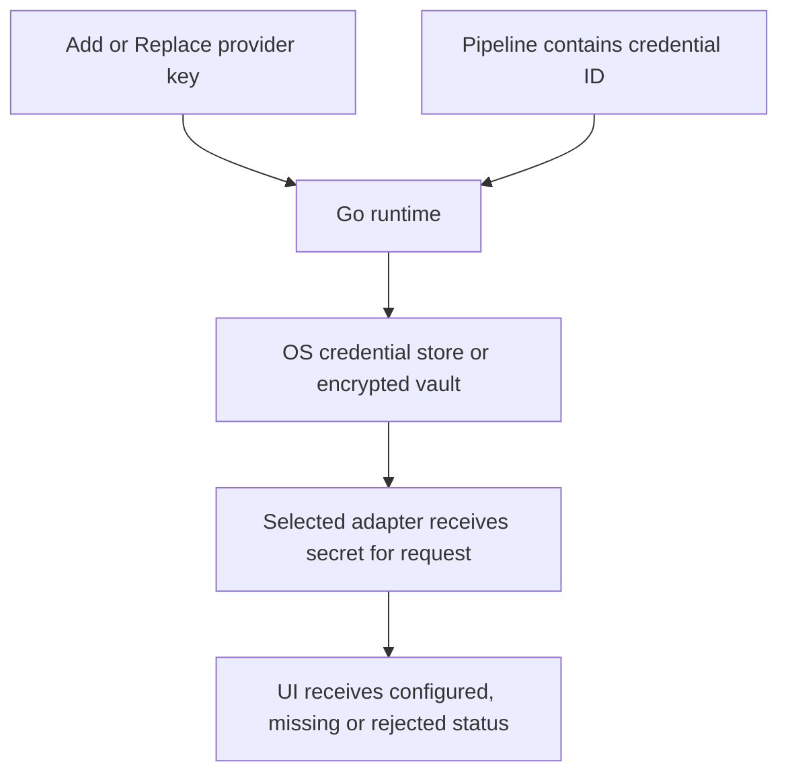

# Credentials and data access

## Secret storage

The runtime owns a `SecretStore` interface. Prefer Windows Credential Manager, macOS Keychain and Linux Secret Service. Store opaque credential IDs in pipeline, storage and database configuration, the catalog and job records. The runtime resolves a secret only for the selected adapter and does not return its value to the GUI or status API. S3 access keys/session tokens, PostgreSQL connection credentials and ArcadeDB credentials use the same secret-reference boundary; connection records and object references never embed passwords or signed URLs.

A headless Linux machine may lack an unlocked Secret Service. Support a passphrase-encrypted vault or session-only credentials as explicit alternatives; never fall back to plaintext. The vault uses a reviewed password KDF and authenticated encryption through maintained libraries. Its key is not saved beside ciphertext. Pin and test the exact algorithms and platform integration; do not implement custom cryptography.

Show Configured, Missing or Rejected without displaying stored values. Replacing a key starts only after the user selects Replace; deleting it explains affected presets. A password/key input can reveal only the newly entered value at the user's request, never retrieve a saved value for display. Tests must cover logs, errors, URLs, process arguments, traces and GUI response payloads for secret disclosure.

## Provider routing

Each pipeline makes local/remote routing visible by stage. Transcription can send audio; reasoning usually sends selected transcript text; query assistance normally sends a prompt and schema. The selected stage explains the actual payload and provider. Remote use is a user configuration choice, with no silent escalation from a local failure to an unselected hosted service.

Storage/database setup similarly explains where media, metadata and graph facts reside. A configured remote artifact store may hold originals, metadata snapshots, corpus clips and trained models; a PostgreSQL catalog or ArcadeDB graph sends its corresponding records to that endpoint. Optional remote training sends the selected dataset/base-model inputs according to the chosen adapter. Once this routing is configured, routine jobs proceed without repeated approval. Changing endpoints or export destinations is an explicit configuration/action, and failures do not silently switch to another backend.

Endpoint configuration supports user-hosted servers and frontier providers through capability adapters. TLS certificate validation is enabled by default. Local HTTP endpoints can be supported explicitly without treating all configured endpoints as public cloud services. A model endpoint accepting requests is not proof that it supports transcription, diarization or tool queries.

## Local access and diagnostics

Local IPC is restricted to the current user and verifies protocol/version during connection. Worker output and source text are untrusted data; parse and validate them without treating embedded instructions as runtime authority. Third-party executable adapters are user-selected code, with their source and permissions described clearly. Launchers use hidden noninteractive execution on Windows.

Operational logs contain stage IDs, elapsed time, input/output hashes and readable error categories. Media, transcript excerpts and credentials are excluded by default. A user can create a diagnostic bundle with a preview of included fields. It omits keys and local path details unless deliberately included. Keep logs bounded and deletable.

With the default local backends, source bytes and catalog/graph records remain local unless selected processing or export sends them elsewhere. Configured remote storage and databases use the routing described above. Raw metadata may contain locations, device identifiers or other source facts. Preserve it as library evidence and exclude it from routine diagnostic bundles or unselected provider payloads. Speaker models, embeddings and dataset manifests retain the same configured storage/access boundary as their source corpus.

Credential encryption does not encrypt every local or remote artifact. Transport encryption and server/filesystem encryption settings are separate documented properties. Workspace encryption follows the selected filesystem and object-store configuration.
