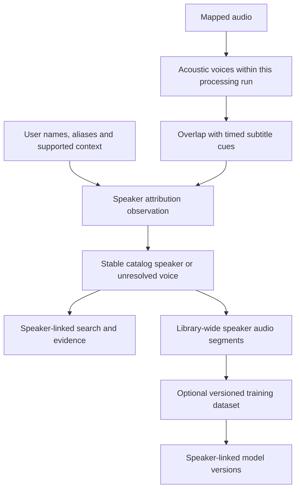

# Speakers and terminology

## Voices, speakers and aliases

A diarization voice such as Voice 1 is scoped to a media asset and processing run. It is not a global person ID. A catalog speaker is a stable user-facing identity with canonical name, aliases and optional supporting facts. The relationship between a voice and speaker records its basis, scope, confidence and provenance. Unknown voices remain searchable as voices.

Acoustic diarization answers which voice spoke when. Name resolution answers who that voice may represent. A mentioned person, a quoted statement, a scene participant and a speaking voice are different observations. Reasoning adapters can suggest supported names, and user edits are authoritative for their selected scope. Unsupported identity remains unresolved rather than blocking valid source-level search.

Aliases have stable IDs, language/scope and provenance. Identical name text does not automatically merge people. Merging and splitting speakers create reversible identity revisions and reproject affected relationships. User-owned fields survive machine refresh. Voice embeddings, if enabled, remain separate optional artifacts with the producing model, source segments and attribution revision recorded.

## Attribution across the library

Every speaker relationship records whether it came from a user assignment, an acoustic comparison, a reasoning adapter or another declared source. Run-local diarization, cross-media similarity and user corrections remain separate observations even when they support the same current speaker assignment. A confidence score does not become proof of identity, and a term or person mentioned in a transcript does not become the speaking identity automatically.

The selected pipeline can apply model-generated assignments automatically when their output contracts validate. Review of each voice or segment is not a prerequisite to processing or optional training. Users can filter assignments by basis or diagnostics, override an assignment and rerun affected work. A trained model or embedding can contribute a later comparison observation; record that dependency so a prediction derived from an earlier assignment is not presented as independent corroboration.

## Speaker-tagged audio segments

The segment catalog spans the whole workspace library. Each `speaker_audio_segment` identifies an original media asset, audio stream/channel selection, ordered source interval and the diarization run/voice that produced it. It references any extracted audio artifact, its transform/time map and the transcript cues that overlap it. Segment intervals use the original media clock even when recognition ran on resampled or concatenated derivatives.

Keep the acoustic interval record separate from its revisioned speaker attribution. An unresolved voice still has usable intervals and searchable media evidence. Resolving it to a speaker makes those intervals available through that speaker's library-wide segment query without decoding the source again. Different runs may propose overlapping intervals for the same source; selected-run and deduplication rules prevent treating duplicate processing as additional speech.

Audio extraction can materialize a segment on demand or in a batch. The result records exact source bytes, interval boundaries, channel policy, sample format, transform/tool version and output digest. Training adapters receive prepared audio with a recorded mapping back to these segments. Segments remain useful for playback, export and analysis even when model training is disabled. Selection, dataset snapshots and model retrieval are defined in [speaker-linked voice models](voice-models.md).

## Identity revisions and model lineage

A merge records the prior speaker IDs and the surviving catalog identity. It combines current query membership while preserving attribution observations, segment IDs, training origins and model-family histories. It does not combine trained weights or silently replace a model version. A split records the new identities and revisioned interval assignments; partially resolved intervals retain their explicit unresolved state.

Identity edits update the current segment view and mark affected dataset-selection recipes as needing a fresh snapshot. An already created dataset snapshot, running training job or completed model version retains the exact speaker/attribution revisions used when it was created. Completed artifacts acquire an attribution-change diagnostic where applicable, rather than silently claiming that their original corpus matches the corrected identity. Speaker queries include lineage so models remain discoverable after merges or splits. Current model associations can be corrected without erasing their originating speaker or dataset provenance.

## Specialized terms

Users maintain a shared terms collection and optional project/language subsets. Each entry contains a stable term ID, canonical spelling, variants, language, context, active state, revision and an optional explicit speaker/alias link. Names and relevant aliases join general terms when compiling transcription context. The join uses IDs, not accidental text matches.

The compiler selects terms by media language and context, orders and deduplicates them deterministically, and respects the recognizer's supported prompt or hotword budget. Record the exact effective list and digest on the job. Unsupported hints are reported, not silently claimed as applied. Excess terms show a preview of omissions. A term is context for recognition, not evidence that a named person spoke.

Guided and unguided transcripts can coexist. Users can compare revisions and select one. A vocabulary change queues affected work or offers an explicit rerun; it never silently alters completed words. The default UI permits adding a name or technical phrase without editing JSON.

## Identity editing experience

The GUI shows the current label, supporting intervals and editable canonical name/aliases. Unknown and ambiguous states have clear labels. A correction may apply to one voice, one media item or a selected identity mapping across the workspace. A scope summary accompanies broad changes; it does not introduce a separate approval queue. CLI operations expose the same IDs and revision checks.

Validated model-driven name suggestions can be applied automatically and corrected or reversed by the user. Confidence is a model diagnostic rather than a measured accuracy guarantee.
