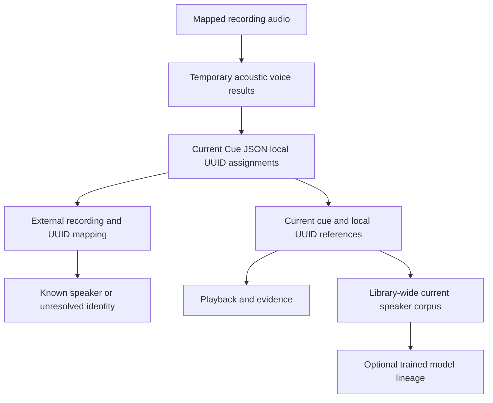

# Speakers and terminology

## Local voices and known speakers

A diarization voice belongs to one recording. Its UUID occurs in the current embedded Cue JSON document; it is not a global person ID. The same person in another recording receives another local UUID. Native subtitle labels and mentioned names remain source observations, independent of that identity. A catalog speaker is a stable user-facing identity with names, aliases and supporting facts.

Acoustic diarization describes which voice spoke when. Known-speaker mapping describes who that voice may represent. A mentioned person, quoted statement, scene participant and speaking voice are different observations. Unsupported identity remains unresolved and does not block valid source-level operations. Model confidence is a diagnostic, not proof of identity.

Known-person corrections update the external recording/UUID mapping without rewriting subtitle text or document bytes. Mapping rows bind current document identity and expected revision. A removed local UUID cannot retain an active mapping. Other records cannot establish another list of assignments under a voice, segment or attribution-revision name.

## Reference-only speaker audio

A current segment record refers to recording ID, document digest, cue ID and local speaker UUID, with an optional managed clip reference. It stores no copied interval, channel, known-person assignment or attribution array. Query and playback resolve the interval from current embedded assignments and the recording's source map. Untimed participation does not provide an exact clip interval, and uncovered acoustic speech does not gain invented subtitle cues.

The speaker corpus spans all current library recordings. A source can contribute overlapping voices, and deduplication uses original source/cue evidence rather than counting repeated processing as independent speech. Lazy extraction uses verified source bytes and explicit transform/time mapping. A clip is derived current data and cannot retain an obsolete assignment as an alternative authority.

Replacing the current document removes stale segment/membership references and invalidates dependent evidence and prepared corpus data. Mapping correction preserves the current document/segments while invalidating dependent selection/preparation. Physical cleanup retires removed managed clips/manifests after leases and reference barriers allow deletion. Source media and supplied subtitles remain immutable.

## Identity, model lineage and correction

Names and aliases use explicit IDs, language/scope and provenance. Equal name text does not merge people automatically. Broad merge/split, similarity and terminology controls remain the speaker-management contract; they use the same current-reference rule when delivered.

A merge or split updates current mappings and invalidates affected corpus preparation. Completed model weights/checkpoints can retain originating source IDs, hashes, run identity and staleness diagnostics. They do not preserve an old transcript or assignment list. An invalidated corpus cannot be used again without resolving current evidence and rebuilding its preparation. [Speaker audio and voice models](voice-models.md) defines those relationships.

Configured model-generated assignments can be applied automatically when their contracts validate. Users can correct them without reviewing every voice or segment. Optional embeddings and model comparisons name their actual input/model provenance; a prediction derived from an earlier assignment is not independent corroboration.

## Specialized terms

The terms contract covers stable IDs, canonical spelling, variants, language/context, active state, revision and optional explicit speaker/alias links. Names and relevant aliases join general terms when compiling supported recognition hints. IDs govern the join, not accidental text equality.

Compile and deduplicate hints deterministically within the chosen recognizer's supported budget. Record the effective digest/settings and report unsupported or omitted hints. A term is recognition context, not evidence that a named person spoke. A vocabulary rerun replaces the current subtitle result after acceptance; guided/unguided alternatives and obsolete text are not retained as selectable transcripts.

## CLI and desktop parity

Current recording inspection, local-UUID mappings and mapping correction use shared CLI/runtime operations, exposed through the desktop bridge. Dedicated speaker/terms GUI controls follow the broader desktop delivery contract. Corrections use the same IDs, expected revisions and current-reference validation in every client.
