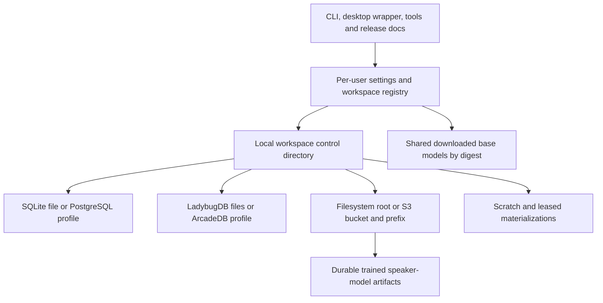

# Installation and storage

## Application and user data

Install executable code in ordinary platform application locations. Never store user media inside the installed application directory or the source checkout. App upgrades replace code and bundled docs while preserving user workspaces and settings. An uninstall removes application code; deletion of user data is a separate explicit choice.

| Platform | GUI and CLI package location | Default user configuration and state | Cache and model downloads |
| --- | --- | --- | --- |
| Windows | Per-user `%LOCALAPPDATA%/Programs/insonic/`; CLI-only can use the same package root | `%APPDATA%/insonic/` for settings, `%LOCALAPPDATA%/insonic/` for workspace registry and local state | `%LOCALAPPDATA%/insonic/Cache/` and `Models/` |
| macOS | `~/Applications/insonic.app` or `/Applications/insonic.app`; CLI installed from the same package with an explicit PATH option | `~/Library/Application Support/insonic/` | `~/Library/Caches/insonic/` for disposable data; durable models under Application Support |
| Linux | Appropriate distro/portable GUI package; user CLI under `~/.local/bin/` with runtime assets under `~/.local/lib/insonic/` | XDG config/data/state directories with `insonic/` children | XDG cache for disposable data; XDG data for durable models |

Installers use these user-space locations. Windows PATH changes and macOS CLI links are installer options with clear effects. The GUI always installs a usable CLI even when the user declines a global PATH entry. System-wide installation is optional; normal local use does not require elevated privileges.

## Three independently selected profiles

A workspace selects an artifact storage profile, catalog profile and graph profile. The default is local filesystem, SQLite and LadybugDB. Generic S3-compliant providers, including user-run filesystem-backed S3 endpoints, PostgreSQL and ArcadeDB are supported alternatives. A local S3 endpoint still uses the S3 adapter; its underlying filesystem is not exposed as a second source of truth.

Profiles contain adapter ID/version, nonsecret options and credential references. Guided configuration asks for filesystem location or S3 endpoint/bucket/prefix/region/addressing style, PostgreSQL host/database/TLS settings, and graph location or ArcadeDB endpoint/database. Credentials use the [secrets service](security.md). A preflight describes reachability, permissions and capabilities without uploading library content or modifying an existing database. Initial schema creation and its target are part of the explicit workspace-create command. Selecting a backend once does not require repeated human approval for every normal write.

| Role | Default | Fully supported alternative | Required behavior |
| --- | --- | --- | --- |
| Artifact storage | Local filesystem | Generic S3 API, local or remote | Immutable publish, stat/ranged read, materialization, verification, retention, export and recovery |
| Operational catalog | SQLite | PostgreSQL | All logical records, jobs, settings, metadata, associations, revisions, leases, outbox, migrations and backup/restore |
| Graph projection | LadybugDB | ArcadeDB | Projection/rebuild, evidence queries, saved graph views, native dialect queries and recovery |

No backend is silently substituted after failure. The local defaults need no server administration. Remote alternatives require the user's configured service and credentials; their installation/deployment guidance is separate from normal desktop installation.

## Catalog operation and transfer

The shared catalog provides revision-checked settings and immutable typed metadata/date records, scoped speaker/corpus/training/model relationships, durable job attempts, expiring workspace ownership and ordered graph events. Their processing and projection producers remain separate implementation work. SQL and connection details stay inside the adapter. Audit instants retain ISO text and exact signed nanoseconds; reports/options use lossless JSON alongside typed relationship columns.

SQLite opens the selected local file with foreign keys on every connection, immediate writer transactions, WAL and full synchronization. PostgreSQL uses a dedicated schema, short workspace-row ownership transactions and server time sampled after locking. Both accept operation IDs and intent digests atomically with revisions and receipts; retrying the same intent reconciles an unknown acceptance outcome. An obsolete attempt cannot renew or publish after expiry, cancellation or takeover. Outbox consumers receive only the next unacknowledged target event and acknowledge under current fenced ownership.

`catalog show --json` reports selected catalog identity, schema and revision. `catalog export <file>` writes a consistent versioned logical snapshot into a new private file; it refuses to overwrite existing output. `catalog restore <file>` accepts an empty catalog with the same workspace identity, verifies the snapshot digest and relational constraints, restores in one transaction and expires imported claims. Preserve the original workspace configuration/identity while selecting an empty destination catalog. Export does not copy artifact bytes or switch configured profiles. Restore and explicit migration require the local owner to be stopped; an idle owner exits automatically.

`jobs history <job-id> [after-generation] --json` returns up to 128 attempts and a nullable `next_generation` cursor. Pass that cursor as `after-generation` to read the next page. `--request-id <UUID>` lets clients retry a start, cancel or retry operation after a lost response with the same identity and intent. Restore inputs are limited to 64 MiB; artifact bytes remain in their configured store.

An optional profile `expected_backend_version` constrains the selected catalog's actual engine version. Use an exact dotted version or comma-separated comparisons such as `>=18,<19` (up to eight comparisons). The constraint is preserved in immutable profile revisions and snapshots; an incompatible engine prevents startup.

For PostgreSQL, configure host, port, database, dedicated schema, TLS mode and optional CA/credential reference in the catalog profile. `verify-full` verifies certificate and hostname; `local` explicitly selects unencrypted local transport. `catalog migrate` provisions the selected schema using migration authority. Runtime opening of an existing schema needs ordinary catalog data permissions, not schema-creation rights. No PostgreSQL environment connection defaults or pgpass routing override the selected profile, and no backend is silently substituted.

The runtime resolves PostgreSQL credentials through an injected provider or the explicitly selected `INSONIC_SESSION_CREDENTIALS` transient mapping of credential IDs to username/password objects. Resolved values stay in memory and never enter snapshots, jobs, receipts or diagnostics. Persistent native/encrypted credential storage remains a separate secrets-service implementation. A missing configured credential returns unavailable rather than falling back to plaintext persistence or a different catalog.

## Workspace and artifact layout

A workspace has a stable identity and a user-selected local control directory. First run suggests a location and estimates capacity. Several workspaces can share downloaded base models while keeping media, speaker models and catalogs logically separate. A remote artifact store or catalog does not eliminate local scratch, decoding materializations or the control directory.

| Local workspace path | Authority and retention |
| --- | --- |
| `workspace.json` | Workspace ID and nonsecret backend/profile/schema references |
| `catalog.sqlite` | Authoritative catalog when SQLite is selected; not a second ledger for PostgreSQL |
| `graph/` | LadybugDB projection when selected; no live ArcadeDB database copy |
| `objects/sha256/<prefix>/<digest>` | Default filesystem store for original, derived, metadata, subtitle, training and model artifacts |
| `exports/` | User-requested portable outputs |
| `logs/` | Bounded, rotated operational logs |
| `tmp/` | Incomplete acquisitions and job scratch |
| `cache/` | Verified disposable materializations of remote/external objects |

Logical artifact records contain a stable ID, SHA-256 digest, byte length and content type observations. Separate location records identify the storage profile and managed key, plus bucket/version ID when applicable. Paths of local cached copies are runtime materializations with leases, not permanent artifact identities. A source audio clip and its model output stay associated with their speaker through catalog IDs even if objects move to another provider. See the [schema](schema.md) and [voice model lifecycle](voice-models.md).

Filesystem keys are relative to the managed root. Explicit external file references remain distinguishable from managed copies. Moving a local workspace rebinds its root and validates bytes without rewriting Cueson documents. Reject traversal and ambiguous portable paths. Follow symlinks only under the documented import policy, without allowing archive extraction outside its destination. Arbitrary filenames and provider URLs are never interpolated into a shell command.

## Artifact adapter and S3 guarantees

The artifact adapter contract includes `Capabilities`, `Stat`, `OpenRange`, `PublishImmutable`, `Materialize`, `Verify` and `DeleteUnreferenced`. Publication returns a receipt with storage profile, final key/version, digest, size and verification method. Capabilities declare conditional create, ranged reads, multipart/resume, provider checksum semantics, version IDs and read-after-write behavior. They are probed or qualified for the selected implementation, not inferred from an S3-compatible label.

Amazon S3 documents [conditional writes](https://docs.aws.amazon.com/AmazonS3/latest/userguide/conditional-writes.html) and [strong read-after-write consistency](https://docs.aws.amazon.com/AmazonS3/latest/userguide/Welcome.html#ConsistencyModel); generic providers must establish their own equivalent behavior. Multipart ETags are [not whole-object content hashes](https://docs.aws.amazon.com/AmazonS3/latest/userguide/checking-object-integrity-upload.html). insonic computes its own digest and records provider checksums separately.

For filesystem output, stage on the destination filesystem, hash and flush, then atomically publish without replacing a different object. For S3, complete an upload at an immutable key and verify readable final bytes before committing a catalog reference. Use conditional create when verified; otherwise use a unique attempt key so no existing admitted object is overwritten. Content deduplication is a catalog decision. Where trustworthy end-to-end provider checksums are unavailable, read back and hash the completed object. For a provider with delayed visibility, wait within a bounded policy and leave the publication pending if visibility cannot be proven. Object listings alone never determine whether an artifact exists.

Adapters support streaming and bounded local materialization for tools needing seekable files. Unknown remote results are reconciled by exact key/version and digest. Incomplete multipart uploads retain attempt identity and can be resumed or aborted. Cleanup waits for active leases and a grace period, then atomically claims retirement in the catalog while checking retention references. That claim prevents new reference/materialization admission until retirement is reconciled. Delete only the claimed object key/version/generation; a read-then-delete reference check alone is insufficient. Do not reuse remote keys while an earlier delete can still finish. Filesystem publication/deletion shares the lifecycle lock. Historical provenance retains retired/missing availability, and source media, metadata reports, training snapshots and models are never treated as disposable cache.

## Catalog adapter and PostgreSQL ownership

The catalog contract provides typed reads, transactional `CommitRevision`, immutable evidence admission, job claim/renew/complete, workspace lease acquisition/renewal, outbox claim/acknowledgement, migrations, consistent snapshot export and restore. SQL is confined to each backend implementation. Both backends enforce the [same logical constraints](schema.md), pagination and revision behavior. SQLite enables foreign keys for every connection, uses its transactional writer model and keeps its file on a supported local filesystem. A live SQLite catalog is not placed in S3 or shared as a network object.

PostgreSQL uses a dedicated configured database/schema and least-privilege application role. Setup distinguishes runtime rights from migration/administration rights. Remote TLS verifies the service identity by default; a configured local service can explicitly use its local transport. PostgreSQL documents [certificate/hostname verification](https://www.postgresql.org/docs/current/libpq-ssl.html). Host credentials, passwords and full connection strings with secrets do not enter exports or logs.

Each catalog query includes workspace scope. Transactions use expected revisions to reject lost updates. Workspace-scoped coordinator, migration and projection leases store owner ID, generation and expiry; PostgreSQL uses server time and short row-locking transactions to acquire/renew them. Jobs may use its [queue-oriented `SKIP LOCKED` support](https://www.postgresql.org/docs/current/sql-select.html#SQL-FOR-UPDATE-SHARE), followed by recorded claim generations. Leases are not a database-wide lock. Work outside a transaction must prove its generation again before publication; paused or disconnected workers cannot acknowledge a replacement worker's result.

Transactions never remain open during audio decoding, AI calls or model training. Retry serialization/deadlock failures only around idempotent transactional operations. A lost commit response triggers operation-ID reconciliation. PostgreSQL selection requires the full catalog path, including restoration and failure recovery; it is not considered supported after only a successful connection test.

## Capacity, migration, backup and recovery

Before a managed copy, derivative or training job, estimate local scratch and final-store capacity separately. For object services with no capacity API, report that distinction and handle quota failures. Cache cleanup never removes leased inputs. Base model removal lists dependent presets. Trained speaker models are durable artifacts with their own retention rules and are not grouped into downloadable-model cache cleanup.

Backups bind a consistent catalog snapshot to an artifact manifest at one catalog revision. Use SQLite's [online backup API](https://www.sqlite.org/backup.html) or the PostgreSQL adapter's consistent snapshot/export path; neither alone backs up media/model bytes. A self-contained backup copies and verifies the referenced immutable bytes into retained backup storage. A reference-only backup records exact object versions and its dependence on the original store. Catalog retention references prevent insonic cleanup from deleting pinned objects for the backup's lifetime; provider retention must independently preserve those versions. A version ID alone identifies bytes without guaranteeing their availability. Record graph checkpoints and either take a coordinated graph snapshot or rebuild it from accepted evidence on restore. Validate schema compatibility, hashes and external references before activating a restored workspace.

Backend migration exports typed records and immutable manifests, validates destination constraints and bytes, then switches profiles at a recorded catalog revision. Pause affected writes under the workspace migration lease. Retain the old authority until the destination is verified; migration never creates two writable catalogs. Exact SQL, index and graph DDL differ by backend, while logical schema version and application behavior remain aligned. Unsupported newer schemas open with an actionable incompatibility message and are not downgraded silently.

Catalog and artifact adapters must pass interrupted publication, reconnect, stale-lease and round-trip migration checks on filesystem/SQLite and S3/PostgreSQL. Graph adapters apply the corresponding acceptance matrix. Normal pull-request checks use bounded fixtures; version-qualified backend integration checks run for the affected adapter without forcing every prose edit through heavyweight services.
