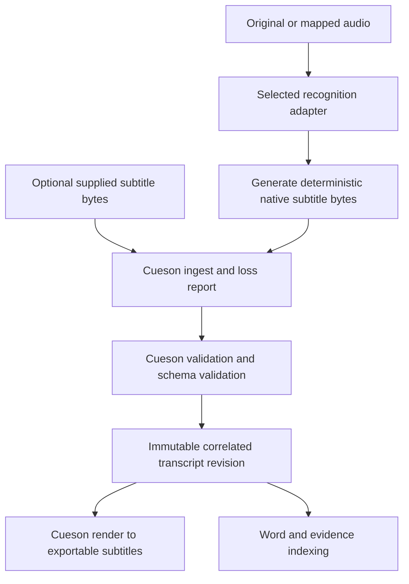

# Cueson and subtitles

## Unified subtitle contract

Cueson is a required dependency for subtitle admission, normalization, validation and rendering. insonic bundles a compatible pinned executable and the matching immutable Cue JSON Schema. The dependency contract uses [Cueson v1.1.0](https://github.com/shruggietech/cueson/releases/tag/v1.1.0). Qualify exact commands and pin release artifacts for every supported package.

Use [official Cue JSON](https://github.com/shruggietech/cueson/blob/v1.1.0/docs/schema.md) as the common subtitle representation. Native input/output formats are SubRip, WebVTT, ASS and SSA. Cueson's canonical format identifiers are `subrip`, `webvtt`, `ass` and `ssa`; `srt` and `vtt` are command aliases. Document `$schema` and `schema_version` are distinct from the producer version.

Do not extend Cue JSON with insonic paths, media identities or machine identifiers. insonic correlation metadata belongs in a catalog record or sidecar referencing the immutable transcript hash and cue IDs. The subtitle document retains upstream schema validity.

## Supplied and generated tracks

The supplied subtitle file is preserved byte-for-byte. Cueson's exact restoration of its source envelope and semantic rendering are different operations. Rendering does not promise original formatting fidelity. Conversion losses are retained in a readable report; strict conversion can fail before publishing output. A supplied track and a generated track may coexist, with an explicit selected revision.

Recognition adapters supply timed text to a deterministic native SRT/WebVTT writer. Cueson encodes that real generated file, retaining its source envelope and native fields, then validates and renders the result. Retain raw recognition output and the generated subtitle digest as processing provenance; generated subtitle bytes do not pretend to be supplied original evidence. If an adapter supplies text without timing, the pipeline must use alignment or report that a correlated transcript remains pending. Fabricating segment times is forbidden.

## Completion contract

A completed speech pipeline has original-media correlation, valid Cue JSON, recorded recognition/alignment provenance, and an exportable subtitle artifact. The initial canonical companion export is SRT for broad interoperability, with WebVTT available for playback and richer ASS/SSA exports where supported. Exports live in managed derived storage; writing beside an external original is an explicit export destination choice.

No supplied subtitle is required for audio or video. Classification can identify music and ambient sound as exceptions to automatic speech work. Mixed or unknown media remains eligible for processing, and an override permits forced transcription. Failures retain imported media and explain the missing transcript step.

Zero detected speech has a distinct `no-speech` outcome, preserving the run and allowing a model/threshold override. Cueson v1.1.0 requires at least one cue in SubRip/WebVTT Cue JSON, so the selected SRT/WebVTT companion route cannot represent a valid zero-cue Cue JSON transcript. Do not invent speech or claim a correlated subtitle was produced. Record `no-speech` separately until an upstream-compatible empty companion representation is available. ASS/SSA zero-dialogue documents do not change the selected route's compatibility.

## Timing and edits

Cueson timing uses integer milliseconds. The insonic source map preserves its higher-resolution input and conversion policy. Cues with overlapping speech retain overlap. Speaker attributions live as revisioned observations linked to cues and acoustic voice intervals; editing a name does not rewrite raw recognition evidence.

Transcript corrections create a new revision with author, time and affected cue identities. Word search and semantic chunks bind the selected revision. Changing selection queues affected graph projections and makes pending status visible. All results can navigate back to media-relative time and the exact cited text.

Speaker audio segments are audio intervals, not synthetic clips cut solely at subtitle cue boundaries. A training dataset can join the exact selected transcript/cue revision to mapped segments when its adapter requires text/audio pairs. Preserve overlapping speech and alignment limitations in that dataset receipt; changing a transcript invalidates affected future dataset selection without rewriting previously trained model provenance. See [speaker audio and voice models](voice-models.md).
