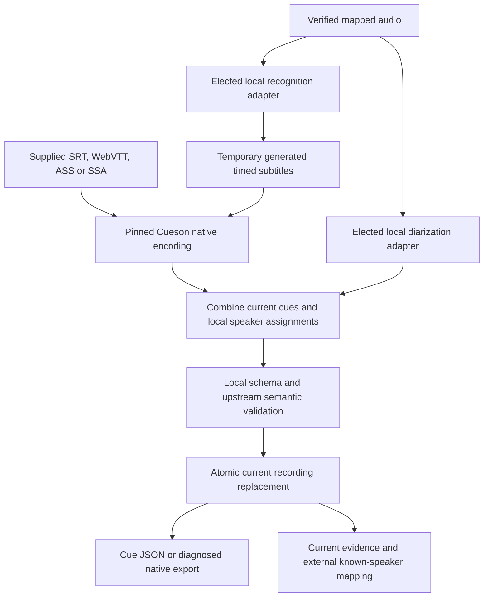

# Cueson and subtitles

## Current document authority

Cueson v1.2.0 is the required subtitle executable and schema. Use the [published packages](https://github.com/shruggietech/cueson/releases/tag/v1.2.0) and the matching [immutable schema](https://github.com/shruggietech/cueson/blob/v1.2.0/schema/releases/v1.2.0/cueson.schema.json), validated from local packaged bytes. The executable boundary supplies encoding, validation, inspection, rendering and conversion; upstream internal Go packages are not a public integration API.

Each recording has one current finalized Cue JSON document embedded in its master record. Its cue-contained `speaker_attributions` are the only persisted speaker assignments. Canonical audio remains an immutable managed asset; supplied native bytes remain in the current Cueson source envelope. Owner-owned originals stay untouched. Generated native subtitles and raw diarization output are bounded temporary processing inputs, removed after success, failure or cancellation. They do not become retained alternate transcripts or assignment reports.

Do not add insonic paths, media IDs or machine identifiers to Cue JSON. Recording identity, exact original-clock mapping, processing provenance and document digest remain outside the document. Other records refer to the current recording/document/cue evidence rather than copying annotations. The [master contract](contracts.md) and [logical catalog](schema.md) govern those references.

## Supplied and generated subtitles



Supplied SRT/WebVTT/ASS/SSA or Cue JSON bypasses unnecessary recognition. Local recognition produces real timed text, which a deterministic writer sends through Cueson. The preserved source envelope distinguishes supplied bytes from generated bytes. Exact restoration of that envelope and semantic native rendering are different operations; rendering does not promise original formatting fidelity.

A completed result records source identity, mapped-audio relationship, tool/model/settings provenance, valid current Cue JSON and its digest. Work receipts retain IDs, hashes and diagnostics, without another document or turn array. Acceptance validates document correctness separately from the [diarization quality diagnostics](pipelines.md#local-processing-and-quality-diagnostics).

Explicit audio replacement with a cleared or absent transcript publishes `untranscribed` with a null document. It makes no recognition or silence claim. No-speech has an explicit outcome with a null document. Speech without usable subtitle timing is `no-timed-subtitles`, with its limitation reported. SRT/WebVTT requires a nonempty cue sequence; do not invent text, cues or timestamps to fit that container. A failed processing attempt preserves originals and the previously accepted current result.

## Recording-local identity

Inferred voices receive recording-local UUIDs. Imported consumer assignments may use any upstream-valid local speaker token (1 to 256 Unicode characters, excluding controls, bidi formatting and edge whitespace). Preserve exact case and Unicode; equal tokens in different recordings do not merge identities. The external recording/token-to-known-speaker mapping connects them to UUID identities in the [speaker catalog](speakers.md). Native observations can derive deterministic untimed participation when the document contains no assignments, without asserting a person or acoustic interval. Correcting a mapping leaves document bytes unchanged. Corrections supply current recording and mapping revisions.

The [upstream consumer contract](https://github.com/shruggietech/cueson/blob/v1.2.0/docs/consumer-speakers.md) permits multiple ordered assignments, overlapping voices and repeated occurrences within a cue. An assignment is either a positive timed interval or explicit untimed participation. Untimed participation means the voice participates somewhere within that cue; it does not assert continuous speech over the cue.

Reusing diarization reconstructs timed activity with the maximum occurrence multiplicity found in any overlapping cue, so overlapping cue containers do not invent additional voices and repeated occurrences within one cue remain represented. Untimed participation carries forward only when its cue payload and timing are unchanged. A changed cue produces an explicit omission diagnostic instead of transferring participation to different evidence.

## Exact source time and millisecond projection

Original-clock mapping preserves explicit integer/rational source offsets, selected streams/channels and transform identity. Cue JSON uses integer milliseconds on the document timeline. Known duration comes from media probing, never cue coverage. Omit root `media_timing` when duration is unknown; preserve an explicit measured zero. Project measured duration downward to whole milliseconds while retaining higher-resolution measurement outside Cue JSON.

Validate positive nonnegative raw turn intervals and known media bounds before assembly. Intersect valid turns with cue coverage, then project inward using `ceil(start_ns / 1000000)` and `floor(end_ns / 1000000)`. Report rounded, clipped, uncovered and collapsed portions. A collapsed interval produces no invented assignment. Untimed participation requires explicit cue/local-token evidence and is not a fallback for failed timing conversion. Do not create a cue for an uncovered gap.

Timed assignments must fit their cue and declared media boundaries. Source cues outside declared media produce upstream conflict diagnostics while remaining unchanged and restorable. Unknown duration leaves media-boundary checking unavailable. Overlap remains represented independently for each voice.

## Reruns and current replacement

Diarization-only reruns reuse current subtitle text and cue IDs without recognition. Transcription replacement rebuilds the current document and reconciles affected mappings and references. Publication checks current source/recording revision and a live work fence, then accepts the complete result in one catalog transaction. Revoked, cancelled or stale attempts cannot replace current data.

Accepted replacement removes superseded current rows and queues physical retirement of removed managed derivatives through recoverable cleanup. Referenced or leased bytes remain pending until their retirement conditions are met. Temporary candidates never become hidden retained alternatives. Interrupted work before acceptance resubmits ephemeral assembly input or recomputes configured processing; after acceptance it reconciles the receipt without rerunning inference.

Playback, query, export and future training resolve current references. Missing cues/local IDs, changed mapping or changed document identity invalidate obsolete dependent evidence and preparation. Preserve provenance IDs/digests and completed model outputs without keeping old assignments or alternative transcripts.

## Export and bounds

Cue JSON export preserves consumer assignments and declared timing. The current native SubRip and WebVTT exports omit those fields. Return readable omission diagnostics for every occurrence; strict mode refuses before exposing any lossy output bytes. Matching native formats use upstream `render`, and different formats use `convert`. Export destinations must be new explicit files; export does not silently overwrite an existing file.

The upstream permits 1,024 assignment occurrences per cue. Native loss accounting is bounded at 8,192 observations; exceeding it refuses export rather than truncating the report. The adapter bounds current documents and subprocess streams at 16 MiB and each Cueson command at two minutes, honoring a shorter caller deadline. Large current documents use bounded pages; export writes to its explicit destination without returning unbounded bytes over IPC.

## Qualification

Committed licensed audio/video, supplied subtitles and constructed speaker results exercise real Cueson, timing, storage, replacement, recovery and export. Constructed speaker turns are test oracles, never evidence that an engine identified a voice correctly. Required checks do not run transcription or diarization, import/load their models, download weights or require engine results. Real engine qualification is an explicit maintainer operation outside CI and merge requirements, described in [development](development.md).

## Shared CLI operations

Configure the exact local tool identities, then use recording operations through the shared runtime. Every recording command names the library media UUID.

```sh
insonic processing tools configuration.json
insonic recordings show MEDIA_UUID
insonic recordings document MEDIA_UUID
insonic recordings mappings MEDIA_UUID
insonic recordings process MEDIA_UUID --input options.json
insonic recordings assemble MEDIA_UUID --input ephemeral-turns.json
insonic recordings map-speaker MEDIA_UUID --input mapping.json
insonic recordings resolve-segment MEDIA_UUID --input segment-reference.json
insonic recordings export MEDIA_UUID --input export.json
```

Processing options elect supplied, generated or reused transcription and running or reused diarization, with managed model IDs for elected inference. Resubmission of an interrupted ephemeral assembly supplies its subtitle input and turns again. After accepted publication, its receipt reconciles a retry without rerunning inference. Document retrieval pages exact bytes as base64 with a digest; current segment resolution returns the cue and known-speaker mapping on request without storing copies. Export specifies a new absolute destination and refuses overwrites. Native-export diagnostics aggregate every represented occurrence by stable code, with redacted messages and first-occurrence pointers; strict refusal includes those diagnostics before publishing bytes.

The desktop bridge exposes the same operations. Full recording and model controls remain documented GUI lag.

Direct current/historical import and embedded selection use the [shared admission contract](ingestion.md#transcript-and-embedded-admission). Supplied timing remains unchanged, including native cues outside measured audio. Timed consumer assignments must fit known canonical audio intervals mapped into the original source clock; unknown duration leaves that check unavailable, while measured zero remains zero. Untimed participation does not claim continuous audio. Engine-produced assembly retains its measured-bound validation.
