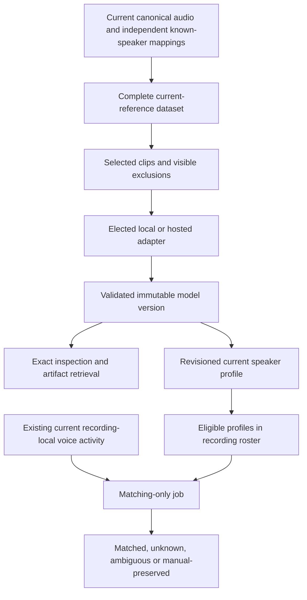

# Speaker audio and voice models

## Elected training from current evidence

Speaker-tagged audio across the workspace is reusable input to elected speaker-model training. Ordinary import, transcription, diarization and search do not require a trained speaker model. CLI and desktop use the same dataset, training, retrieval and roster-matching operations and durable jobs. Selecting the configuration elects the work; no individual sample approval is required.

Training and acoustic enrollment are distinct operations. The `insonic-speaker` adapter invokes an explicitly selected local executable or hosted service that implements the speaker-training contract. It can train architecture-specific weights and publish declared compatible outputs. The built-in `pyannote-profile` adapter enrolls a duration-weighted normalized embedding profile using the exact offline pyannote base bundle. Enrollment does not claim to update the base model's parameters. The current roster matcher consumes compatible embedding profiles; arbitrary weights and hosted handles are not automatically runnable by that consumer.



## Dataset selection and preparation

Dataset creation resolves every page of current speaker references. The independently attributed corpus includes manual mappings, including an explicit correction or confirmation of a previous prediction. A roster declaration and an automatic identity prediction contribute no independent enrollment evidence. This prevents matching guesses from becoming their own confirmation.

The recipe can select recordings, languages, a source channel, interval duration bounds, explicit reference exclusions and overlap exclusion. Decoded signal filters accept configured minimum RMS amplitude and maximum clipping fraction. These are technical measurements with visible diagnostic counts, not universal acoustic-quality thresholds. Missing timing, duplicate source spans, empty audio and unusable input are diagnosed. A language filter excludes evidence whose language cannot be established. A reference exclusion names its exact recording/cue/local-voice key.

A dataset contains ordered recording/document/cue/local-voice references, exact source and mapping authority, a recipe and summary. It never stores copied speaker assignments or subtitle text. Current references resolve intervals from the embedded Cueson document. Preparation selects the canonical track/channel and source clock, rounds clip boundaries inward to complete samples, and materializes only the adapter's required inputs. Transcript text is transient input only when the selected trainer declares it necessary.

Document/audio replacement or a manual identity correction invalidates affected membership and preparation. Invalidated records clear obsolete content-bearing references and options. Owned preparation and manifests are retired through recoverable cleanup. Original inputs and completed model weights/checkpoints retain their independent identities. Running work cannot silently substitute new evidence halfway through an attempt; publication revalidates exact current authority.

Large dataset inspection returns counts and a manifest reference rather than an unbounded inline array. This presentation bound does not limit training membership. Use artifact inspection/materialization to inspect the complete current manifest.

## Saved training profiles and durable jobs

Saved pipeline configurations can include a `speaker_training` profile independently of recognition/diarization stages. It declares the adapter, output kind, optional base-model reference and effective parameters. Elect an exact pipeline ID/revision, or supply an explicit inline declaration. Admission resolves aliases into immutable base identities and freezes the effective configuration before acquisition or execution. Editing a saved profile cannot retarget accepted work.

```sh
insonic models dataset create --input dataset.json --json
insonic models dataset list --input speaker-filter.json --json
insonic models dataset show DATASET_ID --json
insonic models train --input training.json --json
insonic work show WORK_ID --json
insonic work cancel WORK_ID --json
```

For example, `dataset.json` supplies `speaker_id` and an optional `recipe`. A saved-profile training election supplies `dataset_id`, `name`, `pipeline_id` and `pipeline_revision`. An inline election instead supplies `adapter` and `output_kind`, with optional `base_model_id`, `parameters`, existing `family_id` and an exact `checkpoint_id`. The rendered [JSON contracts](contracts.md) define each strict payload.

An executable dataset input shape is:

```json
{
  "speaker_id": "11111111-1111-4111-8111-111111111111",
  "recipe": {"min_duration_us": 1000000, "exclude_overlap": true}
}
```

For local embedding enrollment, replace the illustrative UUIDs with a current dataset and registered compatible base bundle. The configured processing worker must be pinned and available:

```json
{
  "dataset_id": "22222222-2222-4222-8222-222222222222",
  "name": "Current speaker profile",
  "output_kind": "voice-embedding",
  "base_model_id": "base:33333333-3333-4333-8333-333333333333",
  "adapter": {
    "id": "pyannote-profile", "contract_version": "1", "mode": "local",
    "architecture": "pyannote", "output_kinds": ["voice-embedding"],
    "consumers": ["voice-matching"], "supported_operations": ["voice-matching"]
  }
}
```

Training uses the shared renewable scheduler, worker concurrency, cancellation and retry authority. Phases distinguish preparation, training, validation and publication; explicitly hosted execution uploads only elected prepared data. Compatible checkpoints record producing work/attempt, step, digest, adapter and base identity. An unsupported or incompatible resume fails explicitly. A partial checkpoint is not a completed model. A cancelled or stale attempt cannot accept a model version.

## Local and hosted adapter contract

`insonic-speaker` contract version `1` uses bounded JSON requests/results. Local execution requires a hash-pinned absolute executable and optional pinned support files, literal arguments, hidden noninteractive child execution and confined scratch/output paths. The request names `train` or supported `resume`, exact work/attempt/base identity, effective parameters and prepared inputs. Outputs declare kind, architecture, supported operations, compatible consumers, artifact role/format/hash/size and optional immutable checkpoints.

Hosted execution uses an explicitly configured HTTPS endpoint or loopback HTTP endpoint, a remote model/upstream revision and an optional encrypted credential reference. Redirects and secret-valued configuration are rejected. The adapter receives prepared media bytes rather than local paths. It returns bounded artifact bytes or a stable opaque hosted-only model handle, never a transient or credential-bearing download URL. A failed local operation never selects a hosted route automatically. Cancellation closes the selected request; a provider must implement the declared cancellation semantics, and a disconnected request alone is not proof that independent remote work stopped.

Outputs pass declared shape, compatibility and digest checks before publication through configured filesystem or S3 storage. Catalog acceptance then fences the producing work and current dataset. Unaccepted owned outputs are retired on failure. Validation establishes integrity and declared compatibility; it does not establish acoustic accuracy or subjective model quality.

## Immutable versions, current profiles and retrieval

The model family is stable; each accepted version has immutable originating speaker, dataset/run/work, producing attempt, adapter/base/settings, output kind, compatibility, rights declarations and artifact identities. Current corpus validity is independent of completed output availability. Source corrections invalidate preparation while exact completed outputs remain retrievable. Unknown license declarations remain explicit, and exports exclude credential values and temporary local paths.

Current profile selection is revisioned state. Selecting, replacing or clearing a profile does not rewrite old weights or their origin. Explicit reassociation makes a family discoverable for the selected current speaker while retaining its originating identity. Corrected identities require valid current evidence for new training; reassociation alone does not create corpus membership.

```sh
insonic models speaker list --input speaker-filter.json --json
insonic models list --speaker SPEAKER_ID --json
insonic models speaker show VERSION_ID --json
insonic models speaker fetch VERSION_ID --destination MODEL_DIRECTORY --json
insonic models profile set SPEAKER_ID --input profile.json --json
```

`speaker-filter.json` supplies `speaker_id` and optional bounded paging fields. Profile selection supplies the observed `expected_revision` and exact `version_id`; an empty version clears the profile. The filtered list exposes that identity's current profile revision; exact show also reports the originating identity's profile. Fetch validates every available output's hash, writes a portable speaker-model manifest and never substitutes a default or newer version. A hosted-only output reports that downloadable weights are unavailable. Existing base-model inventory commands retain their separate semantics.

## Roster-constrained matching

`recordings match RECORDING_ID --input matching.json` queues matching alone. It reuses current local-voice activity without recognition or diarization. The input elects the exact matching model/adapter and supplies cosine similarity threshold, ambiguity margin and minimum evidence duration. Only compatible selected profiles belonging to current active roster members are candidates. An empty/undeclared roster or unavailable profile receives explicit diagnostics; there is no library-wide fallback.

`matching.json` uses the same `pyannote-profile` adapter declaration above, with `model_id` instead of `base_model_id` and explicit `threshold`, `ambiguity_margin` and `min_evidence_us`. For example, values `0.75`, `0.1` and `1000000` illustrate the input shape; they are not calibrated defaults or a measured accuracy claim. Profile selection accepts `{"expected_revision": 0, "version_id": "44444444-4444-4444-8444-444444444444"}` for a speaker with no prior profile.

Each attempt freezes recording/audio/document, roster, member identity revisions, exact profile/version/manifest, base model and settings. A concurrent edit prevents stale acceptance. Insufficient evidence, a low score or ambiguous candidates remain unknown/ambiguous. A one-member roster does not claim every voice, absent members do not acquire activity, several local clusters may identify one person and roster size is never an implicit diarization count.

Acceptance preserves explicit manual mappings and supersedes applicable prior automatic mappings, including removal when a rerun no longer supports the old match. Bounded current matching provenance stays outside CueJSON. No duplicate assignment arrays, old transcript copies or score archives become alternate evidence. [Speakers](speakers.md) describes roster and correction controls.

## Verification and supported backends

SQLite/PostgreSQL retain the same authority relationships and snapshot checks. Filesystem/S3 store durable outputs; LadybugDB/ArcadeDB project dataset/run/version/current-profile relationships from the catalog. The graph is never the sole model-provenance store.

Required checks use deterministic adapters, scores and supplied evidence, plus bounded real media/Cueson qualification. They do not initialize, download or run acoustic models. Actual enrollment and matching accuracy require separate maintainer qualification of the selected engine, model and corpus; fixture success does not establish that accuracy.
