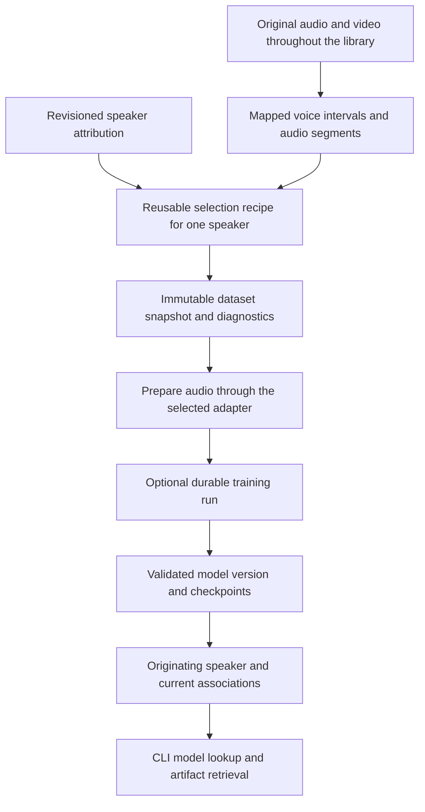

# Speaker audio and voice models

## Optional training from the library

Speaker-tagged audio produced across the library is a reusable input to user-elected voice-model training. A speaker does not require a trained model to exist, be searched or be corrected. Training begins when the user runs or enables a training pipeline, and uses a local or hosted training adapter selected in that pipeline. Transcription and diarization continue independently of that choice.

The catalog records dataset provenance, durable model storage and CLI lookup/retrieval contracts. Training adapters declare their model architecture, output kind and supported operations. Model discovery and fetching use these declarations rather than treating every voice artifact as a synthesizer. A training profile selects the engine and compatible consumers.



## Segment selection and dataset snapshots

A selection recipe resolves one speaker across the workspace, including every matching current library entry rather than only the currently displayed page. It records whether attribution was user-provided or inferred, the selected processing runs, language/channel filters, interval duration bounds, audio preparation settings and optional diagnostic thresholds. The default considers the currently selected speaker assignments from all supported sources. Users can narrow that set by assignment basis, source, date range, language or explicit segment IDs.

The standard preparation preset detects empty audio, overlap, clipping, low signal and decoder failures. It excludes unusable decode output and duplicate source spans. Overlap, signal quality and attribution-confidence filters are configurable selection choices with visible reasons and counts. Recommended thresholds are part of a versioned preset and must be established with the chosen training adapter rather than treated as universal measurements. A dataset summary shows segment count, total original and prepared duration, source coverage, languages, diagnostic counts and all applied exclusions. Users can adjust the recipe or exclude individual entries/segments without reviewing every segment.

A `training_dataset_snapshot` freezes the selection. Store its workspace and originating speaker ID, speaker identity revision, attribution revisions, ordered segment memberships, source hashes/intervals/channels, preparation options, transcript references when required, effective exclusion decisions and manifest digest. Memberships reference the exact revision of each segment and any already prepared `artifact_id`; temporary paths and a mutable query are insufficient provenance. A later preparation manifest binds every final training input artifact to these frozen memberships and options. A recipe can create later snapshots automatically under a configured training schedule, but it cannot change an existing snapshot.

Only required inputs are materialized. A local adapter may require normalized PCM clips; another may consume mapped audio streams. Preserve originals and represent silence trimming, concatenation, normalization or resampling as derived artifacts with their time maps. If a training adapter needs text, its contract names the selected transcript revisions and any alignment requirements. It cannot quietly substitute a newer transcript halfway through a run.

Corrections to speaker mappings, segment boundaries, transcripts or preparation options invalidate future reuse of an affected snapshot as the current corpus. They produce a new snapshot when training is requested again. Existing runs and model versions retain their original inputs and a visible staleness/attribution-change diagnostic. Dataset records remain interpretable even if an external source later becomes unavailable; a new preparation or rerun reports which required bytes are missing.

## Training adapters and durable runs

Add `speaker-model training` as a capability alongside transcription, diarization and embedding. Its request names the dataset snapshot, base-model identity if any, desired output kind, effective hyperparameters, resource limits and credential reference. An adapter declares supported input formats, local or hosted execution, train/resume/cancel behavior, emitted artifact formats and compatible consumers. Separate preparation and training capabilities when different tools perform those operations.

A `training_run` has a stable workspace/job ID, dataset snapshot ID, originating speaker/identity revision, preparation-manifest digest, pipeline revision, adapter/contract version, provider identity, base-model digest or upstream revision, effective parameters and attempt history. The scheduler reports preparation, upload if configured, training, checkpointing, validation and publication. Training uses the same concurrency, cancellation and retry contracts as other jobs. A resumed attempt must identify a compatible checkpoint and preserve the earlier attempt's provenance. Unsupported resume is reported plainly and may require a fresh run.

Checkpoints are immutable artifacts attached to the run and producing attempt. Record their digest, format, training step, required base model, adapter version and resume compatibility. Partial checkpoints do not imply a completed usable model. Training progress and adapter-supplied evaluation metrics are diagnostics with method/version information; the application does not describe an unmeasured result as high quality.

The runtime commits catalog references only after outputs pass their declared shape, file-integrity and compatibility checks and are published through the configured storage adapter. A hosted training service may expose a provider model handle instead of downloadable weights. Record that distinction and its retrieval capabilities. User-selected hosted execution discloses the dataset data it uploads; a failed local training job does not select a hosted provider automatically.

## Model families, versions and storage

`speaker_model` identifies a stable model family in a workspace. Each `speaker_model_version` is immutable and points to its training run/dataset snapshot, originating speaker ID and identity revision, output manifest and all durable artifacts. A version can include weights, tokenizer/configuration files, a reference audio artifact, a provider model handle or another declared format. Current associations and a user-selected default version are revisioned catalog state rather than changes to the version's history.

| Record | Required information |
| --- | --- |
| Family | `workspace_id`, stable family ID, originating `speaker_id`, user name/description and current speaker associations |
| Version | Stable version ID, family ID, originating speaker/identity and attribution revisions, dataset/run IDs, creation time and output state |
| Artifact | `artifact_id`, digest/size, object reference, role, media or model format and availability |
| Compatibility | Model kind, supported operations, required architecture/base model, sample rate/channels where relevant, runtime/dependency versions and supported adapter consumers |
| Provider | Adapter ID/contract version, local executable or hosted service identity, upstream model revision and credential reference without credential values |
| Rights metadata | Declared upstream/base-model and output licenses, attribution text, source of each declaration and unknown values where no declaration exists |
| Diagnostics | Training/evaluation method and metrics, validation results, attribution changes and missing or unavailable artifacts |

Trained speaker artifacts are durable workspace data stored through the configured filesystem or S3 object-storage adapter. Shared downloaded base models remain separately managed by digest. Catalog rows and manifests use portable object references rather than machine-specific absolute paths, and both SQLite and PostgreSQL retain equivalent relationships. The graph can project speaker-to-model, dataset-to-segment and run-to-artifact relationships from the catalog; it does not become the sole record of trained model provenance.

Record license and format information supplied by upstream models/providers. Unknown declarations remain explicit. Export preserves this metadata and excludes credentials and transient signed URLs. A portable model export binds exact version/manifests to available artifact bytes. If a provider only supports hosted access, return its declared hosted-model reference and report that downloadable weights are unavailable.

Merging speakers makes existing families discoverable through identity lineage without merging their weights. Splitting a speaker preserves the original model and dataset histories and exposes which member intervals now have different assignments. Current associations may name the resulting speakers or remain unresolved according to the corrected corpus. The original speaker ID remains queryable in history. Choosing a new default, moving a current association or retraining is an explicit catalog operation; none rewrites an old model version.

## CLI query and retrieval contract

The CLI supplies these operations before any dedicated training GUI is required. Human tables and versioned JSON list speaker/family/version IDs, training/dataset origin, output kind, availability, compatibility and diagnostics. Filters include speaker identity, model kind, adapter compatibility, status and history. Speaker lookup follows current merge/split lineage and identifies why a historical model appears in the result.

Speaker and model operations share the CLI contract:

```sh
insonic speakers segments list --speaker SPEAKER_ID --json
insonic models dataset create --speaker SPEAKER_ID --preset speech-clean --json
insonic models train --dataset DATASET_ID --pipeline PIPELINE_ID --json
insonic models list --speaker SPEAKER_ID --json
insonic models show MODEL_VERSION_ID --json
insonic models fetch MODEL_VERSION_ID --output MODEL_DIRECTORY
```

`dataset create` writes a frozen snapshot and returns its summary and ID. `train` queues a durable job using that snapshot. `list` discovers models from speaker identity; `show` exposes exact provenance and the manifest. `fetch` resolves one exact version, retrieves available artifacts from the selected storage/provider adapter, validates hashes and writes a portable manifest into the requested destination. It reports unsupported provider retrieval or missing artifacts without substituting another model version. Noninteractive runs use supplied options and never pause for segment-by-segment review.

The GUI wraps the same operations through speaker segment/dataset/model summaries and shared job state. The capability matrix records CLI and GUI availability, including advanced or experimental controls that reach the GUI later. [JSON contracts](contracts.md) define corpus, dataset and model interchange.
