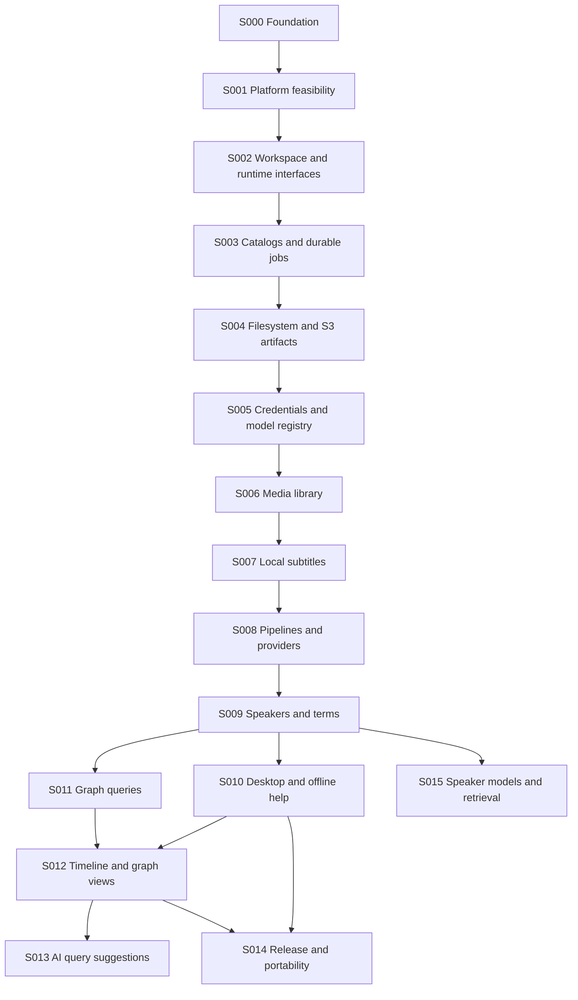

# Staged delivery

## How to use this plan

This dependency-ordered staging map records planned application work. The outcomes are filed as [GitHub issues](https://github.com/shruggietech/insonic/issues), grouped into five milestones and tracked on the linked [insonic Project](https://github.com/orgs/shruggietech/projects/7). Each slice can be subdivided when its acceptance cannot fit a sustainable development session. Keep its scope coherent.

| Slice | Outcome | Main dependencies | Acceptance focus |
| --- | --- | --- | --- |
| S000 | Local repository and v0.0.0 specification | Owner requirements and formal kit | Documentation, tools, site and tracking setup prepared; no publication |
| S001 | Native platform and dependency feasibility | S000 | CLI/runtime/Wails shell, IPC, Cueson, native Ladybug/SQLite pairing, PostgreSQL/S3/ArcadeDB adapter feasibility, hidden launch and offline docs proven on three OSes |
| S002 | Workspace ownership and runtime interfaces | S001 | Platform paths, discovery/locking, shared configuration/operation and job-attempt interfaces, cancellation/retry contracts, hidden launches and redacted diagnostics |
| S003 | Portable catalogs and durable job state | S002 | SQLite/PostgreSQL parity, portable migrations, transactions, durable jobs/recovery, revisioned graph outbox and reserved speaker corpus/training/artifact associations |
| S004 | Filesystem and generic S3 artifact storage | S003 | Default filesystem and full generic S3 parity, immutable writes/references, checksums, staged publication/recovery and secret-reference interfaces |
| S005 | Encrypted credentials and local model registry | S003, S004 | Native secret stores and encrypted fallback, credential status/replacement, adapter authentication, pinned model manifests/download receipts and organized model artifacts |
| S006 | Unified audio/video library | S003, S004, S005 | Local copy/reference and S3-backed import, early raw metadata capture, origination-date/timezone and batch input, provenance, duplicate handling and relocation |
| S007 | Correlated local subtitles | S006 | Audio derivatives/time maps, supplied tracks, default recognition, source-timed speaker segments, Cueson validation/rendering, resumable receipts |
| S008 | Configurable pipelines and providers | S005, S007 | Task capabilities, presets, per-stage overrides, hosted routes and credential UX |
| S009 | Speaker continuity and specialized terms | S008 | Acoustic voices, names/aliases, identity revisions, corpus-wide speaker audio selection, context compilation and configured reruns |
| S010 | Installable GUI with CLI parity and help | S009 | Three-OS GUI packages, common runtime operations, capability/parity matrix, progress, playback and matching offline docs |
| S011 | Graph evidence and query foundation | S003, S009 | Chunk adapters, supported assertions, idempotent LadybugDB/ArcadeDB projections, word/speaker/time queries through CLI |
| S012 | Timeline and saved graph exploration | S010, S011 | All-media calendar/undated timeline, source playback, saved force-directed graphs, keyboard/table alternatives |
| S013 | Optional AI query assistance | S008, S012 | Configured adapter suggestions, visible proposed query by default, elected validated read-only auto-run, direct querying independent of assistance |
| S014 | Release polish and delivery automation | S010, S012 | Remote acquisition expansion, portable backup/export, signed package matrix and release/docs promotion |
| S015 | Optional speaker models and retrieval | S005, S008, S009 | Elected training adapters, immutable corpus snapshots, speaker-associated versioned model artifacts and query-like CLI list/fetch |

## Milestone outcomes

M1 establishes a local CLI library-to-subtitle workflow on Windows, macOS and Linux, with supported storage/catalog alternatives (S001-S007). M2 adds configurable providers, speakers/terms and an installable GUI (S008-S010). M3 delivers source-linked querying with both graph backends, timeline and saved graph exploration (S011-S013). M4 packages durable backup/export, acquisition expansion and publication automation (S014). M5 delivers optional speaker training and speaker-based model retrieval (S015). Milestones do not imply a preselected release number or date. M5 depends on established speaker and adapter contracts; it can proceed alongside later graph work without waiting for M4.

Early CLI packages can be useful before the GUI, but installing the later GUI always installs the CLI. S002 defines runtime and job interfaces; S003 implements their durable catalog state and graph outbox. S004 implements artifact storage through the shared secret-provider interface; S005 supplies the encrypted credential backend and model registry. These boundaries keep the foundational work focused while preserving complete supported-backend behavior. Semantic extraction waits until transcript and speaker contracts are established. Post-release defects may interrupt this sequence with targeted corrective slices.

## Open engineering decisions

S001 must pin a compatible Go/Ladybug native pair, SQLite driver, stable desktop framework version, per-platform IPC and installers; it also proves contract compatibility with PostgreSQL, generic S3 and ArcadeDB. These decisions preserve the promised three-OS capability and supported backend alternatives. S007 chooses hardware-appropriate transcription/diarization models and proves duration/channel mapping. It also resolves Cueson's current zero-cue artifact limitation without inventing speech. S010 proves playback and offline help on each desktop platform. S014 binds website promotion to the exact released docs and selects the hosting destination with the owner. S015 selects suitable training adapters and model validation contracts; the ultimate desktop presentation of trained models remains open while CLI discovery/retrieval is definite.

Direct access to an existing library and direct queries work without a model download or external account. Upstream model distribution terms are described for the chosen model. A failed dependency experiment leads to a documented alternative that preserves the approved scope.

## Current progress

2026-10-04: S000 local foundation is complete. Repository checks, maintainer tests, static export and responsive/offline inspection passed. The exact upstream brand kit retains one recorded semantic proof mismatch. Application slices are unimplemented and unfiled. The same-day specification amendment adds early metadata/date capture, supported storage/database alternatives, explicit CLI parity and elective speaker models; its validation is recorded in the [foundation evidence](000-foundation/verification.md). GitHub setup, first push, release publication and native behavior remain unverified until their corresponding actions occur. The [S000 record](000-foundation/spec.md) distinguishes completed local work from these remaining actions.

2026-10-05: The approved pre-publication review separates the runtime foundation into workspace interfaces, catalog/durable state, artifact storage and credential/model registry slices. The synchronized issue plan now contains S001-S015. Later application outcomes retain their scope and dependencies; the planning codes were renumbered before filing or publication.

2026-10-05: The owner authorized publication. The public repository now contains the foundation on `main`; the initial hosted CI passed, and live setup/readback confirmed all 15 application issues, five milestones, Project tracking and merge/review settings. Application slices remain unimplemented. [Publication evidence](000-foundation/verification.md#publication-evidence) records the initial commit, CI run and remaining verification boundaries.
